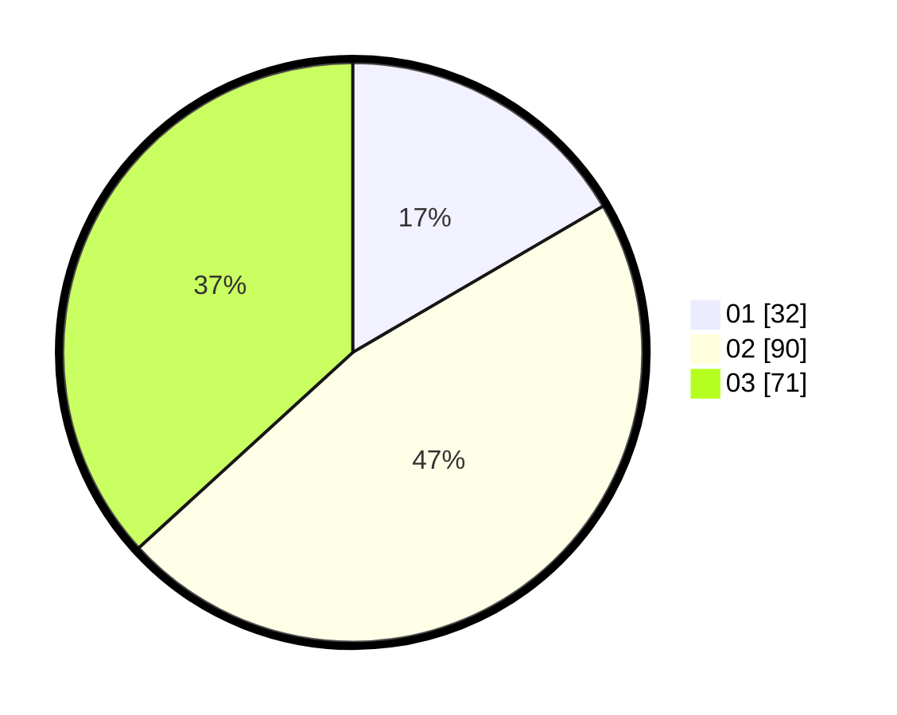

# Hasil

Hasil perolehan suara paslon dapat dilihat pada file paslon-01.txt, paslon-02.txt, dan paslon-03.txt.

Jika tidak ada, artinya data tersebut belum ada pada SIREKAP.

## Perolehan Suara

 * Paslon 01: **32**.
 * Paslon 02: **90**.
 * Paslon 03: **71**.

## Foto C Plano

https://sirekap-obj-formc.kpu.go.id/3e4f/pemilu/ppwp/31/71/02/10/02/3171021002009-20240216-152358--dced51eb-c997-4ae6-975f-97688d6da3ba.jpg

https://sirekap-obj-formc.kpu.go.id/3e4f/pemilu/ppwp/31/71/02/10/02/3171021002009-20240216-152359--47f2c860-2287-41e0-8eed-78fba17735a5.jpg

https://sirekap-obj-formc.kpu.go.id/3e4f/pemilu/ppwp/31/71/02/10/02/3171021002009-20240216-152358--4742d1e1-4469-4e72-8f6b-b4990894b1e5.jpg

## DATA PEMILIH TETAP

Jumlah pemilih dalam DPT: **265**.
 * L: **129**.
 * P: **136**.

## DATA PENGGUNA HAK PILIH

Jumlah pengguna hak pilih dalam DPT: **198**.
 * L: **97**.
 * P: **101**.

Jumlah pengguna hak pilih dalam DPTb: **0**.
 * L: **0**.
 * P: **0**.

Jumlah pengguna hak pilih dalam DPK: **0**.
 * L: **0**.
 * P: **0**.

Jumlah pengguna hak pilih: **198**.
 * L: **97**.
 * P: **101**.

## JUMLAH SUARA SAH DAN TIDAK SAH

JUMLAH SELURUH SUARA SAH: **193**.

JUMLAH SUARA TIDAK SAH: **5**.

JUMLAH SELURUH SUARA SAH DAN SUARA TIDAK SAH: **198**.
