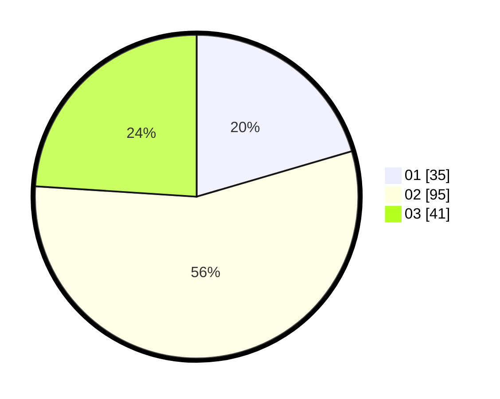

# Hasil

Hasil perolehan suara paslon dapat dilihat pada file paslon-01.txt, paslon-02.txt, dan paslon-03.txt.

Jika tidak ada, artinya data tersebut belum ada pada SIREKAP.

## Perolehan Suara

 * Paslon 01: **35**.
 * Paslon 02: **95**.
 * Paslon 03: **41**.

## Foto C Plano

https://sirekap-obj-formc.kpu.go.id/9394/pemilu/ppwp/31/71/02/10/02/3171021002010-20240216-000527--dc14451f-c8e3-4b2b-ae17-41bf1409d3f6.jpg

https://sirekap-obj-formc.kpu.go.id/9394/pemilu/ppwp/31/71/02/10/02/3171021002010-20240216-000531--5047ca72-482c-4c08-b687-ef58118dc49b.jpg

https://sirekap-obj-formc.kpu.go.id/9394/pemilu/ppwp/31/71/02/10/02/3171021002010-20240216-000528--d4b948dd-28d2-428a-91a9-71c418a81dd2.jpg

## DATA PEMILIH TETAP

Jumlah pemilih dalam DPT: **276**.
 * L: **145**.
 * P: **131**.

## DATA PENGGUNA HAK PILIH

Jumlah pengguna hak pilih dalam DPT: **178**.
 * L: **91**.
 * P: **87**.

Jumlah pengguna hak pilih dalam DPTb: **0**.
 * L: **0**.
 * P: **0**.

Jumlah pengguna hak pilih dalam DPK: **0**.
 * L: **0**.
 * P: **0**.

Jumlah pengguna hak pilih: **178**.
 * L: **91**.
 * P: **87**.

## JUMLAH SUARA SAH DAN TIDAK SAH

JUMLAH SELURUH SUARA SAH: **171**.

JUMLAH SUARA TIDAK SAH: **7**.

JUMLAH SELURUH SUARA SAH DAN SUARA TIDAK SAH: **178**.
