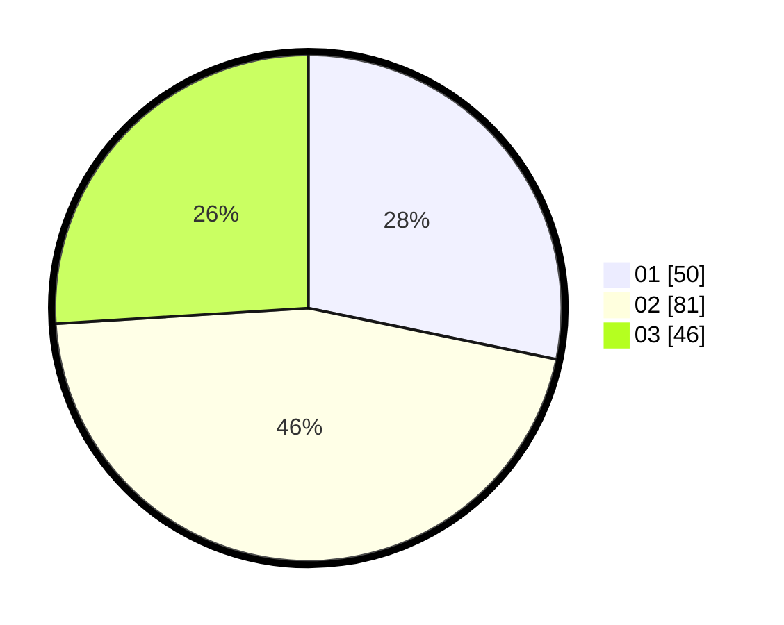

# Hasil

Hasil perolehan suara paslon dapat dilihat pada file paslon-01.txt, paslon-02.txt, dan paslon-03.txt.

Jika tidak ada, artinya data tersebut belum ada pada SIREKAP.

## Perolehan Suara

 * Paslon 01: **50**.
 * Paslon 02: **81**.
 * Paslon 03: **46**.

## Foto C Plano

https://sirekap-obj-formc.kpu.go.id/7d90/pemilu/ppwp/31/71/02/10/02/3171021002012-20240216-153134--255a836c-b3cc-4a20-b246-08b4a22e6df8.jpg

https://sirekap-obj-formc.kpu.go.id/7d90/pemilu/ppwp/31/71/02/10/02/3171021002012-20240216-153136--40ef436c-7b19-4e36-8ffe-ff4c0b87e027.jpg

https://sirekap-obj-formc.kpu.go.id/7d90/pemilu/ppwp/31/71/02/10/02/3171021002012-20240216-153135--061ae510-694a-4cf2-ab6d-9ea834c0504e.jpg

## DATA PEMILIH TETAP

Jumlah pemilih dalam DPT: **279**.
 * L: **149**.
 * P: **130**.

## DATA PENGGUNA HAK PILIH

Jumlah pengguna hak pilih dalam DPT: **178**.
 * L: **93**.
 * P: **85**.

Jumlah pengguna hak pilih dalam DPTb: **0**.
 * L: **0**.
 * P: **0**.

Jumlah pengguna hak pilih dalam DPK: **0**.
 * L: **0**.
 * P: **0**.

Jumlah pengguna hak pilih: **178**.
 * L: **93**.
 * P: **85**.

## JUMLAH SUARA SAH DAN TIDAK SAH

JUMLAH SELURUH SUARA SAH: **177**.

JUMLAH SUARA TIDAK SAH: **1**.

JUMLAH SELURUH SUARA SAH DAN SUARA TIDAK SAH: **178**.
