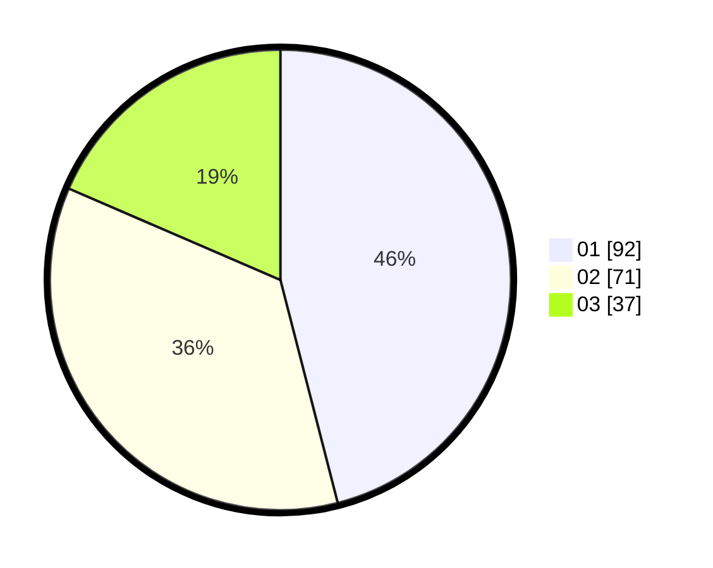

# Hasil

Hasil perolehan suara paslon dapat dilihat pada file paslon-01.txt, paslon-02.txt, dan paslon-03.txt.

Jika tidak ada, artinya data tersebut belum ada pada SIREKAP.

## Perolehan Suara

 * Paslon 01: **92**.
 * Paslon 02: **71**.
 * Paslon 03: **37**.

## Foto C Plano

https://sirekap-obj-formc.kpu.go.id/f126/pemilu/ppwp/31/71/02/10/02/3171021002013-20240216-175747--f3dd37f5-59b6-4939-8901-a9d83a6a2d56.jpg

https://sirekap-obj-formc.kpu.go.id/f126/pemilu/ppwp/31/71/02/10/02/3171021002013-20240216-175747--b5273b2f-e6cb-4c04-a084-3f04813cb072.jpg

https://sirekap-obj-formc.kpu.go.id/f126/pemilu/ppwp/31/71/02/10/02/3171021002013-20240214-193322--eec9459a-7609-42b4-b460-ab232b376982.jpg

## DATA PEMILIH TETAP

Jumlah pemilih dalam DPT: **272**.
 * L: **135**.
 * P: **137**.

## DATA PENGGUNA HAK PILIH

Jumlah pengguna hak pilih dalam DPT: **202**.
 * L: **102**.
 * P: **100**.

Jumlah pengguna hak pilih dalam DPTb: **0**.
 * L: **0**.
 * P: **0**.

Jumlah pengguna hak pilih dalam DPK: **0**.
 * L: **0**.
 * P: **0**.

Jumlah pengguna hak pilih: **202**.
 * L: **102**.
 * P: **100**.

## JUMLAH SUARA SAH DAN TIDAK SAH

JUMLAH SELURUH SUARA SAH: **200**.

JUMLAH SUARA TIDAK SAH: **2**.

JUMLAH SELURUH SUARA SAH DAN SUARA TIDAK SAH: **202**.
