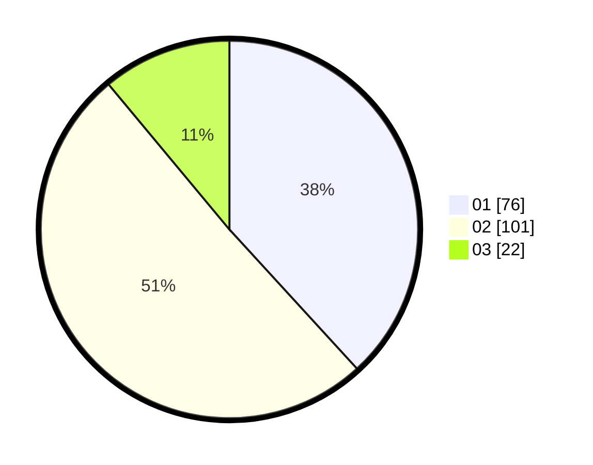

# Hasil

Hasil perolehan suara paslon dapat dilihat pada file paslon-01.txt, paslon-02.txt, dan paslon-03.txt.

Jika tidak ada, artinya data tersebut belum ada pada SIREKAP.

## Perolehan Suara

 * Paslon 01: **76**.
 * Paslon 02: **101**.
 * Paslon 03: **22**.

## Foto C Plano

https://sirekap-obj-formc.kpu.go.id/d4b0/pemilu/ppwp/31/71/02/10/02/3171021002014-20240217-104122--9a9ec0eb-d6ce-4db2-b343-0e28f8937fe1.jpg

https://sirekap-obj-formc.kpu.go.id/d4b0/pemilu/ppwp/31/71/02/10/02/3171021002014-20240217-104123--ade6d20b-0ed4-4389-9f6b-4027bd88fac2.jpg

https://sirekap-obj-formc.kpu.go.id/d4b0/pemilu/ppwp/31/71/02/10/02/3171021002014-20240217-104122--765994f9-dfc4-4da3-8758-c0370b64cb36.jpg

## DATA PEMILIH TETAP

Jumlah pemilih dalam DPT: **267**.
 * L: **136**.
 * P: **131**.

## DATA PENGGUNA HAK PILIH

Jumlah pengguna hak pilih dalam DPT: **198**.
 * L: **99**.
 * P: **99**.

Jumlah pengguna hak pilih dalam DPTb: **1**.
 * L: **1**.
 * P: **0**.

Jumlah pengguna hak pilih dalam DPK: **3**.
 * L: **1**.
 * P: **2**.

Jumlah pengguna hak pilih: **202**.
 * L: **101**.
 * P: **101**.

## JUMLAH SUARA SAH DAN TIDAK SAH

JUMLAH SELURUH SUARA SAH: **199**.

JUMLAH SUARA TIDAK SAH: **3**.

JUMLAH SELURUH SUARA SAH DAN SUARA TIDAK SAH: **202**.
