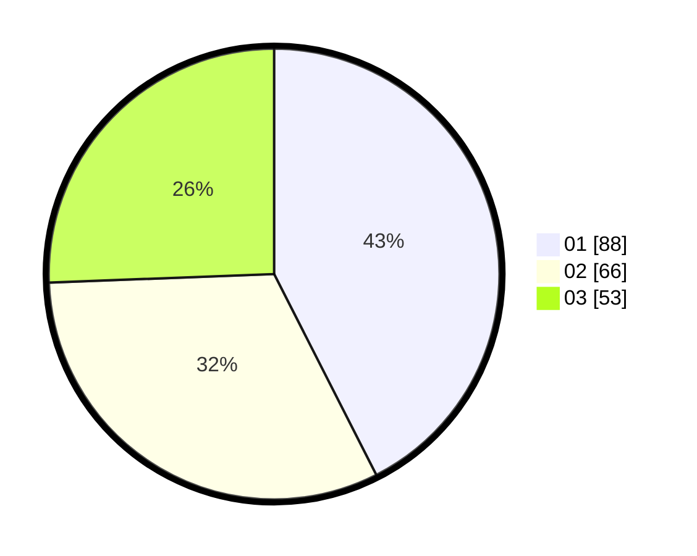

# Hasil

Hasil perolehan suara paslon dapat dilihat pada file paslon-01.txt, paslon-02.txt, dan paslon-03.txt.

Jika tidak ada, artinya data tersebut belum ada pada SIREKAP.

## Perolehan Suara

 * Paslon 01: **88**.
 * Paslon 02: **66**.
 * Paslon 03: **53**.

## Foto C Plano

https://sirekap-obj-formc.kpu.go.id/1cc8/pemilu/ppwp/31/71/02/10/02/3171021002019-20240216-055851--a1834a88-286c-431a-a181-42a67a718b45.jpg

https://sirekap-obj-formc.kpu.go.id/1cc8/pemilu/ppwp/31/71/02/10/02/3171021002019-20240216-055857--d11b3c1e-c89f-4b50-8b28-dc9f8fe0191a.jpg

https://sirekap-obj-formc.kpu.go.id/1cc8/pemilu/ppwp/31/71/02/10/02/3171021002019-20240216-055856--040099b8-5d17-4901-bbf8-86e59a7997fb.jpg

## DATA PEMILIH TETAP

Jumlah pemilih dalam DPT: **275**.
 * L: **137**.
 * P: **138**.

## DATA PENGGUNA HAK PILIH

Jumlah pengguna hak pilih dalam DPT: **206**.
 * L: **104**.
 * P: **102**.

Jumlah pengguna hak pilih dalam DPTb: **0**.
 * L: **0**.
 * P: **0**.

Jumlah pengguna hak pilih dalam DPK: **5**.
 * L: **1**.
 * P: **4**.

Jumlah pengguna hak pilih: **211**.
 * L: **105**.
 * P: **106**.

## JUMLAH SUARA SAH DAN TIDAK SAH

JUMLAH SELURUH SUARA SAH: **207**.

JUMLAH SUARA TIDAK SAH: **4**.

JUMLAH SELURUH SUARA SAH DAN SUARA TIDAK SAH: **211**.
