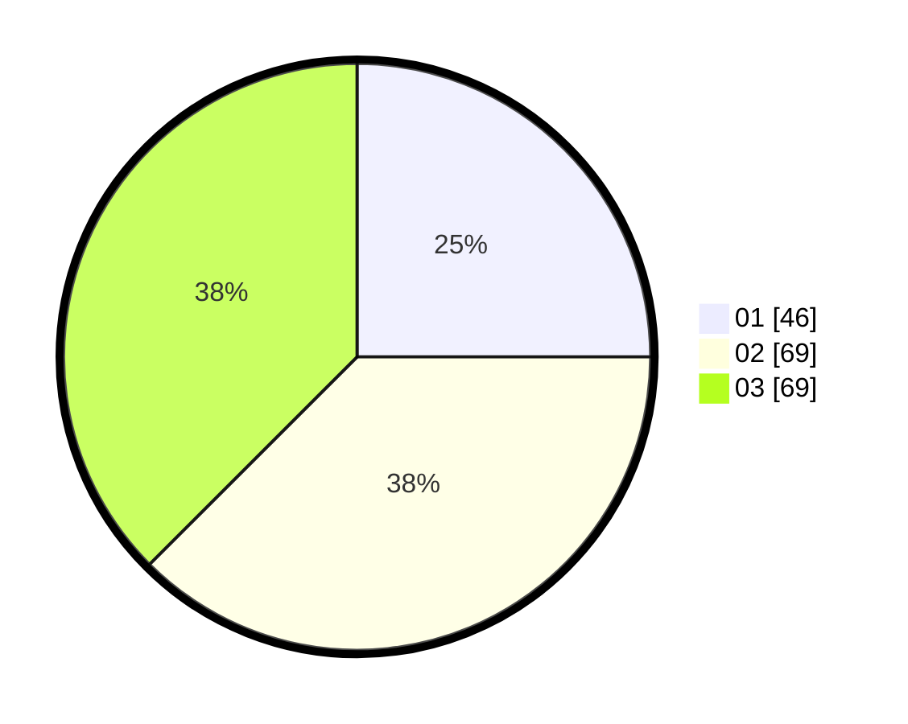

# Hasil

Hasil perolehan suara paslon dapat dilihat pada file paslon-01.txt, paslon-02.txt, dan paslon-03.txt.

Jika tidak ada, artinya data tersebut belum ada pada SIREKAP.

## Perolehan Suara

 * Paslon 01: **46**.
 * Paslon 02: **69**.
 * Paslon 03: **69**.

## Foto C Plano

https://sirekap-obj-formc.kpu.go.id/e0cb/pemilu/ppwp/31/71/02/10/02/3171021002021-20240216-151336--ae496879-28f3-4c2b-a599-0ef4f83ba9f0.jpg

https://sirekap-obj-formc.kpu.go.id/e0cb/pemilu/ppwp/31/71/02/10/02/3171021002021-20240216-151337--ac231346-ac0f-4b25-ae9f-0e4416d5ae6c.jpg

https://sirekap-obj-formc.kpu.go.id/e0cb/pemilu/ppwp/31/71/02/10/02/3171021002021-20240216-105255--9be57785-424f-4a14-93b0-f00b857db701.jpg

## DATA PEMILIH TETAP

Jumlah pemilih dalam DPT: **263**.
 * L: **130**.
 * P: **133**.

## DATA PENGGUNA HAK PILIH

Jumlah pengguna hak pilih dalam DPT: **186**.
 * L: **95**.
 * P: **91**.

Jumlah pengguna hak pilih dalam DPTb: **0**.
 * L: **0**.
 * P: **0**.

Jumlah pengguna hak pilih dalam DPK: **0**.
 * L: **0**.
 * P: **0**.

Jumlah pengguna hak pilih: **186**.
 * L: **95**.
 * P: **91**.

## JUMLAH SUARA SAH DAN TIDAK SAH

JUMLAH SELURUH SUARA SAH: **184**.

JUMLAH SUARA TIDAK SAH: **2**.

JUMLAH SELURUH SUARA SAH DAN SUARA TIDAK SAH: **186**.
