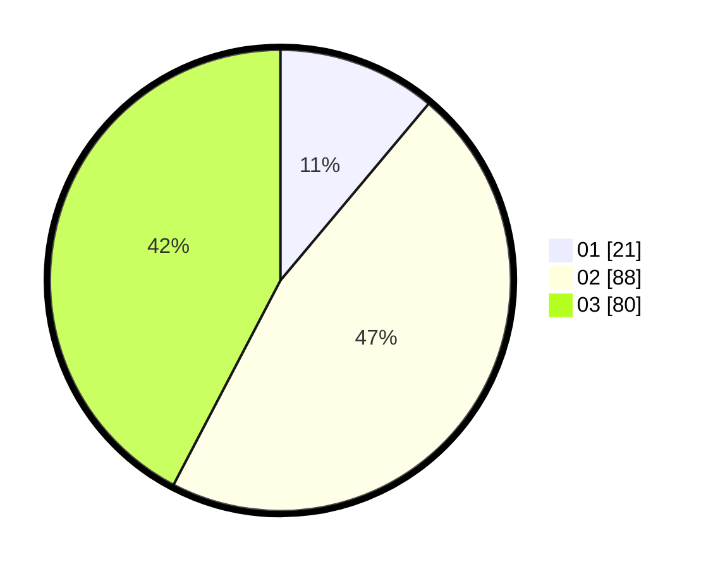

# Hasil

Hasil perolehan suara paslon dapat dilihat pada file paslon-01.txt, paslon-02.txt, dan paslon-03.txt.

Jika tidak ada, artinya data tersebut belum ada pada SIREKAP.

## Perolehan Suara

 * Paslon 01: **21**.
 * Paslon 02: **88**.
 * Paslon 03: **80**.

## Foto C Plano

https://sirekap-obj-formc.kpu.go.id/7a0d/pemilu/ppwp/31/71/02/10/02/3171021002023-20240216-133233--91a85094-2448-42cf-8daf-d0dec393878e.jpg

https://sirekap-obj-formc.kpu.go.id/7a0d/pemilu/ppwp/31/71/02/10/02/3171021002023-20240216-133234--8bdd95a2-208a-4373-94a7-6794c1198b4f.jpg

https://sirekap-obj-formc.kpu.go.id/7a0d/pemilu/ppwp/31/71/02/10/02/3171021002023-20240216-133233--495cab4c-5dbb-4090-8ed0-24d5c37497f8.jpg

## DATA PEMILIH TETAP

Jumlah pemilih dalam DPT: **250**.
 * L: **122**.
 * P: **128**.

## DATA PENGGUNA HAK PILIH

Jumlah pengguna hak pilih dalam DPT: **194**.
 * L: **94**.
 * P: **100**.

Jumlah pengguna hak pilih dalam DPTb: **0**.
 * L: **0**.
 * P: **0**.

Jumlah pengguna hak pilih dalam DPK: **0**.
 * L: **0**.
 * P: **0**.

Jumlah pengguna hak pilih: **194**.
 * L: **94**.
 * P: **100**.

## JUMLAH SUARA SAH DAN TIDAK SAH

JUMLAH SELURUH SUARA SAH: **189**.

JUMLAH SUARA TIDAK SAH: **5**.

JUMLAH SELURUH SUARA SAH DAN SUARA TIDAK SAH: **194**.
