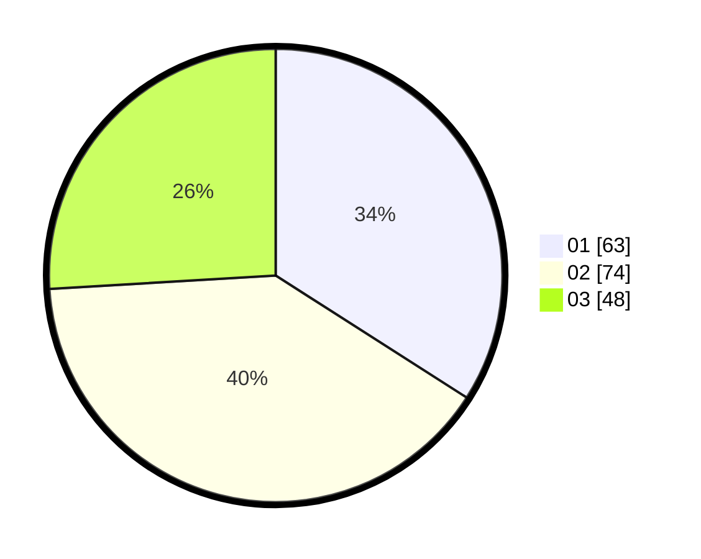

# Hasil

Hasil perolehan suara paslon dapat dilihat pada file paslon-01.txt, paslon-02.txt, dan paslon-03.txt.

Jika tidak ada, artinya data tersebut belum ada pada SIREKAP.

## Perolehan Suara

 * Paslon 01: **63**.
 * Paslon 02: **74**.
 * Paslon 03: **48**.

## Foto C Plano

https://sirekap-obj-formc.kpu.go.id/c7a9/pemilu/ppwp/31/71/02/10/02/3171021002024-20240216-022317--c3a05a80-3802-4296-a3b7-4e23160a61ce.jpg

https://sirekap-obj-formc.kpu.go.id/c7a9/pemilu/ppwp/31/71/02/10/02/3171021002024-20240216-022332--a0773ab9-0e3f-413c-a889-745a1a386ea7.jpg

https://sirekap-obj-formc.kpu.go.id/c7a9/pemilu/ppwp/31/71/02/10/02/3171021002024-20240216-020324--07543fb7-9cfb-4a47-aa1d-b989ecc313ec.jpg

## DATA PEMILIH TETAP

Jumlah pemilih dalam DPT: **267**.
 * L: **134**.
 * P: **133**.

## DATA PENGGUNA HAK PILIH

Jumlah pengguna hak pilih dalam DPT: **184**.
 * L: **92**.
 * P: **92**.

Jumlah pengguna hak pilih dalam DPTb: **3**.
 * L: **2**.
 * P: **1**.

Jumlah pengguna hak pilih dalam DPK: **0**.
 * L: **0**.
 * P: **0**.

Jumlah pengguna hak pilih: **187**.
 * L: **94**.
 * P: **93**.

## JUMLAH SUARA SAH DAN TIDAK SAH

JUMLAH SELURUH SUARA SAH: **185**.

JUMLAH SUARA TIDAK SAH: **2**.

JUMLAH SELURUH SUARA SAH DAN SUARA TIDAK SAH: **187**.
