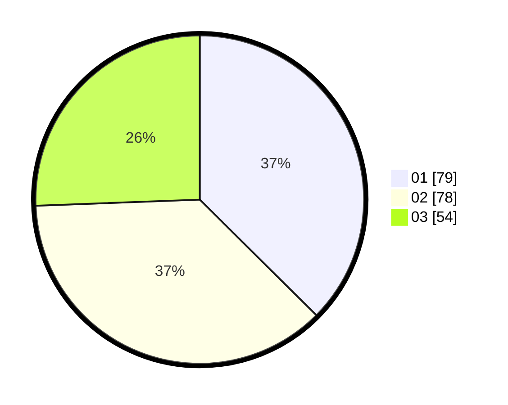

# Hasil

Hasil perolehan suara paslon dapat dilihat pada file paslon-01.txt, paslon-02.txt, dan paslon-03.txt.

Jika tidak ada, artinya data tersebut belum ada pada SIREKAP.

## Perolehan Suara

 * Paslon 01: **79**.
 * Paslon 02: **78**.
 * Paslon 03: **54**.

## Foto C Plano

https://sirekap-obj-formc.kpu.go.id/f851/pemilu/ppwp/31/71/02/10/02/3171021002029-20240216-154304--e3e24771-5b00-4989-8c09-878840477045.jpg

https://sirekap-obj-formc.kpu.go.id/f851/pemilu/ppwp/31/71/02/10/02/3171021002029-20240216-154305--f551ecc7-6465-4ae7-96cf-302c888b7b67.jpg

https://sirekap-obj-formc.kpu.go.id/f851/pemilu/ppwp/31/71/02/10/02/3171021002029-20240216-154304--e6f006a4-8be1-4370-ae60-eadd49df6b29.jpg

## DATA PEMILIH TETAP

Jumlah pemilih dalam DPT: **282**.
 * L: **138**.
 * P: **144**.

## DATA PENGGUNA HAK PILIH

Jumlah pengguna hak pilih dalam DPT: **210**.
 * L: **97**.
 * P: **113**.

Jumlah pengguna hak pilih dalam DPTb: **2**.
 * L: **0**.
 * P: **2**.

Jumlah pengguna hak pilih dalam DPK: **0**.
 * L: **0**.
 * P: **0**.

Jumlah pengguna hak pilih: **212**.
 * L: **97**.
 * P: **115**.

## JUMLAH SUARA SAH DAN TIDAK SAH

JUMLAH SELURUH SUARA SAH: **211**.

JUMLAH SUARA TIDAK SAH: **1**.

JUMLAH SELURUH SUARA SAH DAN SUARA TIDAK SAH: **212**.
