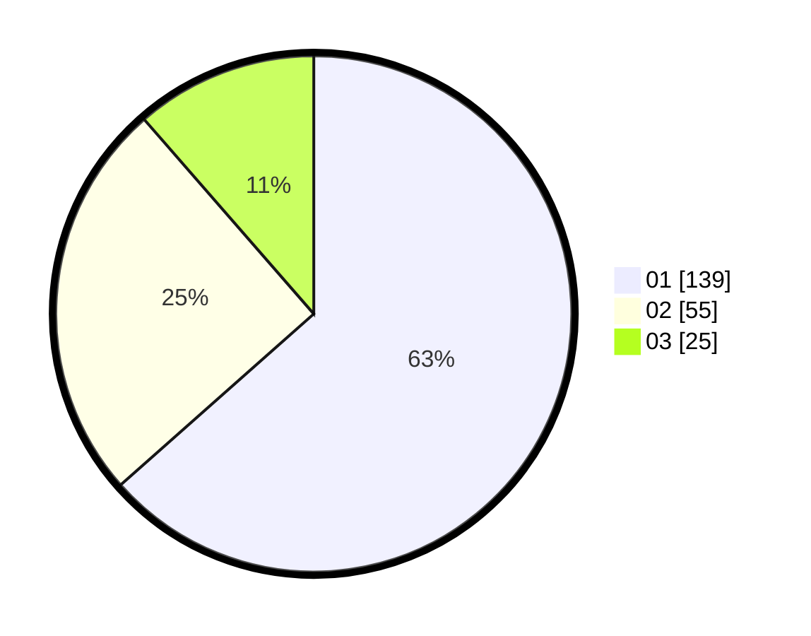

# Hasil

Hasil perolehan suara paslon dapat dilihat pada file paslon-01.txt, paslon-02.txt, dan paslon-03.txt.

Jika tidak ada, artinya data tersebut belum ada pada SIREKAP.

## Perolehan Suara

 * Paslon 01: **139**.
 * Paslon 02: **55**.
 * Paslon 03: **25**.

## Foto C Plano

https://sirekap-obj-formc.kpu.go.id/b2b1/pemilu/ppwp/31/71/02/10/02/3171021002033-20240215-010658--8f2a0b0a-8204-40c9-99ad-5efb40eb96f3.jpg

https://sirekap-obj-formc.kpu.go.id/b2b1/pemilu/ppwp/31/71/02/10/02/3171021002033-20240215-013946--ae5cbe0c-0738-4cc4-92ea-133bf952a334.jpg

https://sirekap-obj-formc.kpu.go.id/b2b1/pemilu/ppwp/31/71/02/10/02/3171021002033-20240215-010819--310d9ac2-e1f8-4666-95fc-f59fa1307374.jpg

## DATA PEMILIH TETAP

Jumlah pemilih dalam DPT: **261**.
 * L: **129**.
 * P: **132**.

## DATA PENGGUNA HAK PILIH

Jumlah pengguna hak pilih dalam DPT: **218**.
 * L: **111**.
 * P: **107**.

Jumlah pengguna hak pilih dalam DPTb: **0**.
 * L: **0**.
 * P: **0**.

Jumlah pengguna hak pilih dalam DPK: **2**.
 * L: **2**.
 * P: **0**.

Jumlah pengguna hak pilih: **220**.
 * L: **113**.
 * P: **107**.

## JUMLAH SUARA SAH DAN TIDAK SAH

JUMLAH SELURUH SUARA SAH: **219**.

JUMLAH SUARA TIDAK SAH: **1**.

JUMLAH SELURUH SUARA SAH DAN SUARA TIDAK SAH: **220**.
