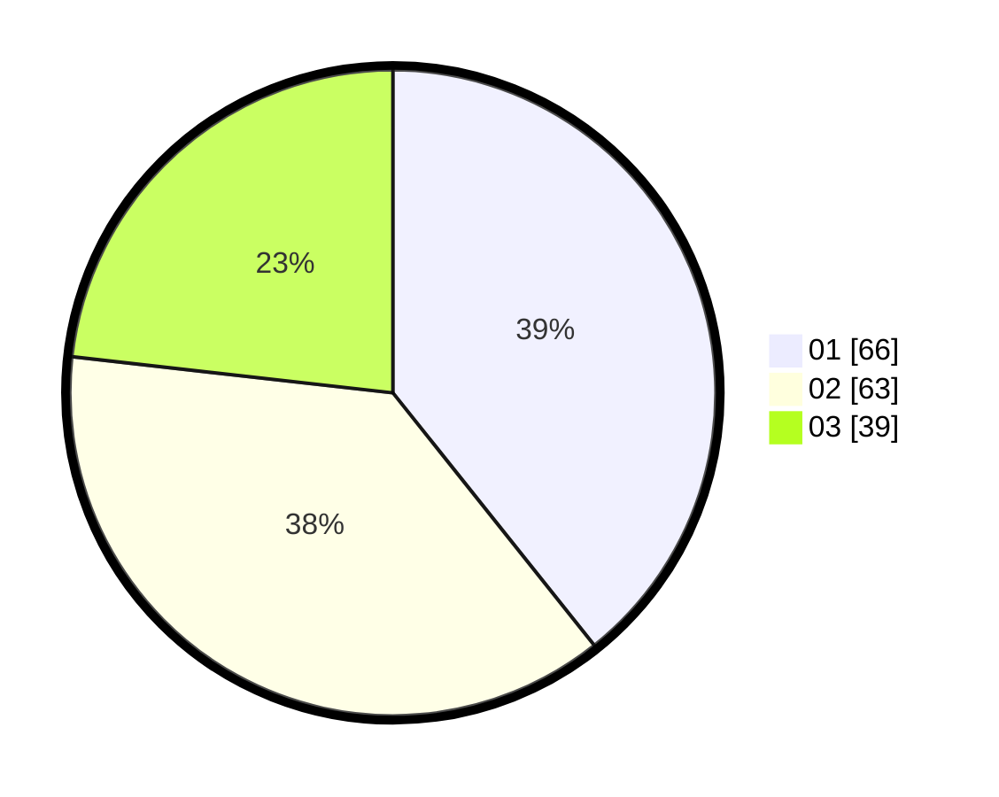

# Hasil

Hasil perolehan suara paslon dapat dilihat pada file paslon-01.txt, paslon-02.txt, dan paslon-03.txt.

Jika tidak ada, artinya data tersebut belum ada pada SIREKAP.

## Perolehan Suara

 * Paslon 01: **66**.
 * Paslon 02: **63**.
 * Paslon 03: **39**.

## Foto C Plano

https://sirekap-obj-formc.kpu.go.id/2e77/pemilu/ppwp/31/71/02/10/02/3171021002037-20240216-112747--4974f357-42b1-4dc4-a36a-e6572ca0839b.jpg

https://sirekap-obj-formc.kpu.go.id/2e77/pemilu/ppwp/31/71/02/10/02/3171021002037-20240216-092107--750653dd-7ee4-4849-b389-96fed38f9ff2.jpg

https://sirekap-obj-formc.kpu.go.id/2e77/pemilu/ppwp/31/71/02/10/02/3171021002037-20240216-112748--6acf951e-aad6-49c9-a2c3-434804feaf63.jpg

## DATA PEMILIH TETAP

Jumlah pemilih dalam DPT: **233**.
 * L: **119**.
 * P: **114**.

## DATA PENGGUNA HAK PILIH

Jumlah pengguna hak pilih dalam DPT: **169**.
 * L: **91**.
 * P: **78**.

Jumlah pengguna hak pilih dalam DPTb: **1**.
 * L: **1**.
 * P: **0**.

Jumlah pengguna hak pilih dalam DPK: **1**.
 * L: **0**.
 * P: **1**.

Jumlah pengguna hak pilih: **171**.
 * L: **92**.
 * P: **79**.

## JUMLAH SUARA SAH DAN TIDAK SAH

JUMLAH SELURUH SUARA SAH: **168**.

JUMLAH SUARA TIDAK SAH: **3**.

JUMLAH SELURUH SUARA SAH DAN SUARA TIDAK SAH: **171**.
