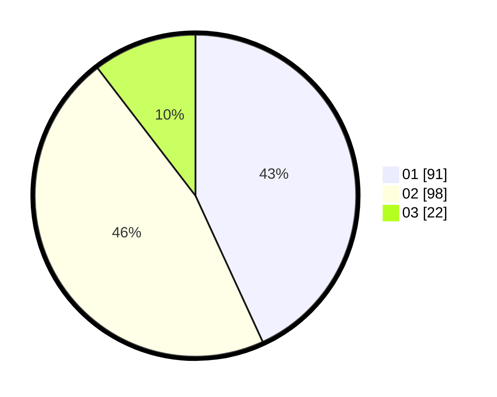

# Hasil

Hasil perolehan suara paslon dapat dilihat pada file paslon-01.txt, paslon-02.txt, dan paslon-03.txt.

Jika tidak ada, artinya data tersebut belum ada pada SIREKAP.

## Perolehan Suara

 * Paslon 01: **91**.
 * Paslon 02: **98**.
 * Paslon 03: **22**.

## Foto C Plano

https://sirekap-obj-formc.kpu.go.id/415b/pemilu/ppwp/31/71/02/10/02/3171021002041-20240216-064933--3f5173d4-d3e1-41ac-9486-06a5892049cb.jpg

https://sirekap-obj-formc.kpu.go.id/415b/pemilu/ppwp/31/71/02/10/02/3171021002041-20240216-064936--07e2f221-fe28-4b33-aebf-9147ecfeef5b.jpg

https://sirekap-obj-formc.kpu.go.id/415b/pemilu/ppwp/31/71/02/10/02/3171021002041-20240216-064934--5947dcea-cce5-453d-aaf9-225a03432737.jpg

## DATA PEMILIH TETAP

Jumlah pemilih dalam DPT: **280**.
 * L: **147**.
 * P: **133**.

## DATA PENGGUNA HAK PILIH

Jumlah pengguna hak pilih dalam DPT: **207**.
 * L: **110**.
 * P: **97**.

Jumlah pengguna hak pilih dalam DPTb: **0**.
 * L: **0**.
 * P: **0**.

Jumlah pengguna hak pilih dalam DPK: **4**.
 * L: **2**.
 * P: **2**.

Jumlah pengguna hak pilih: **211**.
 * L: **112**.
 * P: **99**.

## JUMLAH SUARA SAH DAN TIDAK SAH

JUMLAH SELURUH SUARA SAH: **211**.

JUMLAH SUARA TIDAK SAH: **0**.

JUMLAH SELURUH SUARA SAH DAN SUARA TIDAK SAH: **211**.
