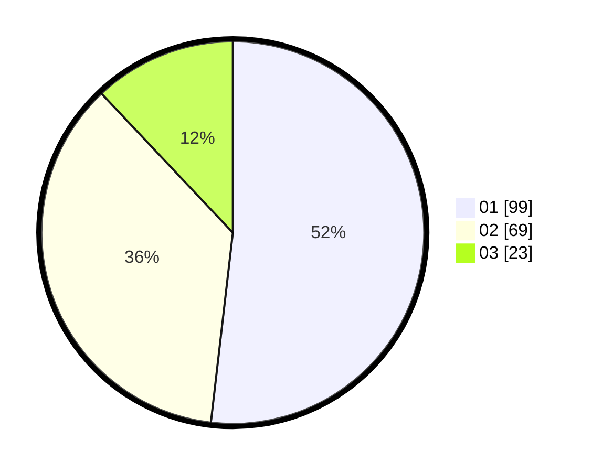

# Hasil

Hasil perolehan suara paslon dapat dilihat pada file paslon-01.txt, paslon-02.txt, dan paslon-03.txt.

Jika tidak ada, artinya data tersebut belum ada pada SIREKAP.

## Perolehan Suara

 * Paslon 01: **99**.
 * Paslon 02: **69**.
 * Paslon 03: **23**.

## Foto C Plano

https://sirekap-obj-formc.kpu.go.id/9e63/pemilu/ppwp/31/71/02/10/02/3171021002042-20240216-174702--ed3b6bf6-db86-4abc-8e89-836526b9b2a5.jpg

https://sirekap-obj-formc.kpu.go.id/9e63/pemilu/ppwp/31/71/02/10/02/3171021002042-20240216-174703--1afaeb81-8ea3-4516-bf83-d84c26421d1e.jpg

https://sirekap-obj-formc.kpu.go.id/9e63/pemilu/ppwp/31/71/02/10/02/3171021002042-20240216-174702--8d9c7fe8-83af-4d5f-bfe1-8d2a12debdb1.jpg

## DATA PEMILIH TETAP

Jumlah pemilih dalam DPT: **283**.
 * L: **151**.
 * P: **132**.

## DATA PENGGUNA HAK PILIH

Jumlah pengguna hak pilih dalam DPT: **193**.
 * L: **105**.
 * P: **88**.

Jumlah pengguna hak pilih dalam DPTb: **0**.
 * L: **0**.
 * P: **0**.

Jumlah pengguna hak pilih dalam DPK: **0**.
 * L: **0**.
 * P: **0**.

Jumlah pengguna hak pilih: **193**.
 * L: **105**.
 * P: **88**.

## JUMLAH SUARA SAH DAN TIDAK SAH

JUMLAH SELURUH SUARA SAH: **191**.

JUMLAH SUARA TIDAK SAH: **2**.

JUMLAH SELURUH SUARA SAH DAN SUARA TIDAK SAH: **193**.
