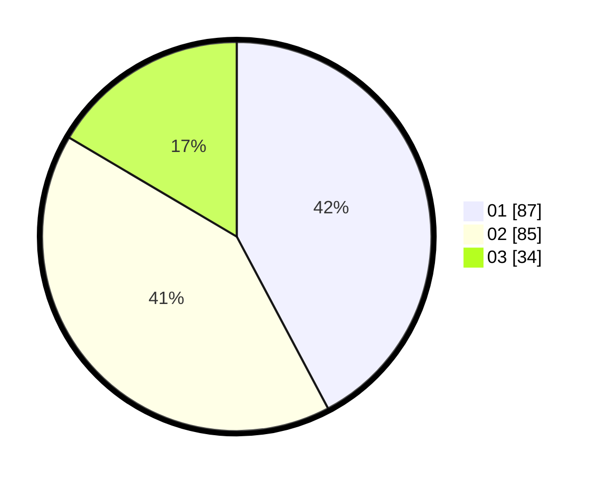

# Hasil

Hasil perolehan suara paslon dapat dilihat pada file paslon-01.txt, paslon-02.txt, dan paslon-03.txt.

Jika tidak ada, artinya data tersebut belum ada pada SIREKAP.

## Perolehan Suara

 * Paslon 01: **87**.
 * Paslon 02: **85**.
 * Paslon 03: **34**.

## Foto C Plano

https://sirekap-obj-formc.kpu.go.id/cfea/pemilu/ppwp/31/71/02/10/02/3171021002043-20240216-160018--37bbb566-a09b-47c6-9a03-af05c89713c5.jpg

https://sirekap-obj-formc.kpu.go.id/cfea/pemilu/ppwp/31/71/02/10/02/3171021002043-20240216-160019--af409cf2-d5bc-4cbb-8c11-add43ed8f3fe.jpg

https://sirekap-obj-formc.kpu.go.id/cfea/pemilu/ppwp/31/71/02/10/02/3171021002043-20240216-160018--fc79d73a-2d3d-4c34-8fbd-a83e7024f230.jpg

## DATA PEMILIH TETAP

Jumlah pemilih dalam DPT: **277**.
 * L: **133**.
 * P: **144**.

## DATA PENGGUNA HAK PILIH

Jumlah pengguna hak pilih dalam DPT: **204**.
 * L: **98**.
 * P: **106**.

Jumlah pengguna hak pilih dalam DPTb: **0**.
 * L: **0**.
 * P: **0**.

Jumlah pengguna hak pilih dalam DPK: **4**.
 * L: **2**.
 * P: **2**.

Jumlah pengguna hak pilih: **208**.
 * L: **100**.
 * P: **108**.

## JUMLAH SUARA SAH DAN TIDAK SAH

JUMLAH SELURUH SUARA SAH: **206**.

JUMLAH SUARA TIDAK SAH: **2**.

JUMLAH SELURUH SUARA SAH DAN SUARA TIDAK SAH: **208**.
