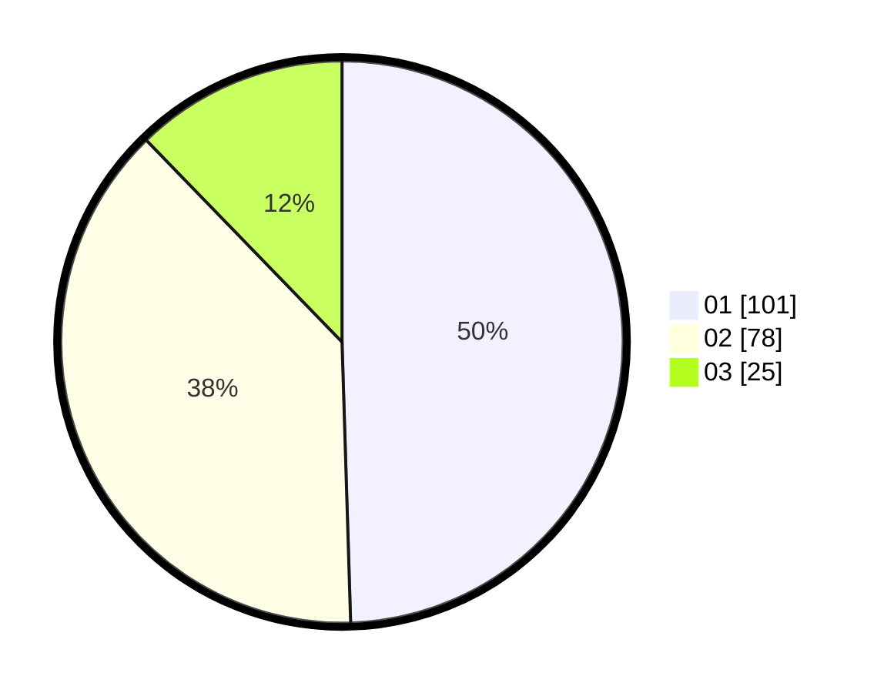

# Hasil

Hasil perolehan suara paslon dapat dilihat pada file paslon-01.txt, paslon-02.txt, dan paslon-03.txt.

Jika tidak ada, artinya data tersebut belum ada pada SIREKAP.

## Perolehan Suara

 * Paslon 01: **101**.
 * Paslon 02: **78**.
 * Paslon 03: **25**.

## Foto C Plano

https://sirekap-obj-formc.kpu.go.id/7e05/pemilu/ppwp/31/71/02/10/02/3171021002045-20240216-123340--fda7c17f-973f-46cd-a57c-741ba7b7666a.jpg

https://sirekap-obj-formc.kpu.go.id/7e05/pemilu/ppwp/31/71/02/10/02/3171021002045-20240216-123341--c8d8918d-35fa-4120-8bb2-71a19a145943.jpg

https://sirekap-obj-formc.kpu.go.id/7e05/pemilu/ppwp/31/71/02/10/02/3171021002045-20240216-123341--f7df7d61-49ae-492f-b3a1-293af313669b.jpg

## DATA PEMILIH TETAP

Jumlah pemilih dalam DPT: **283**.
 * L: **148**.
 * P: **135**.

## DATA PENGGUNA HAK PILIH

Jumlah pengguna hak pilih dalam DPT: **208**.
 * L: **113**.
 * P: **95**.

Jumlah pengguna hak pilih dalam DPTb: **0**.
 * L: **0**.
 * P: **0**.

Jumlah pengguna hak pilih dalam DPK: **0**.
 * L: **0**.
 * P: **0**.

Jumlah pengguna hak pilih: **208**.
 * L: **113**.
 * P: **95**.

## JUMLAH SUARA SAH DAN TIDAK SAH

JUMLAH SELURUH SUARA SAH: **204**.

JUMLAH SUARA TIDAK SAH: **4**.

JUMLAH SELURUH SUARA SAH DAN SUARA TIDAK SAH: **208**.
