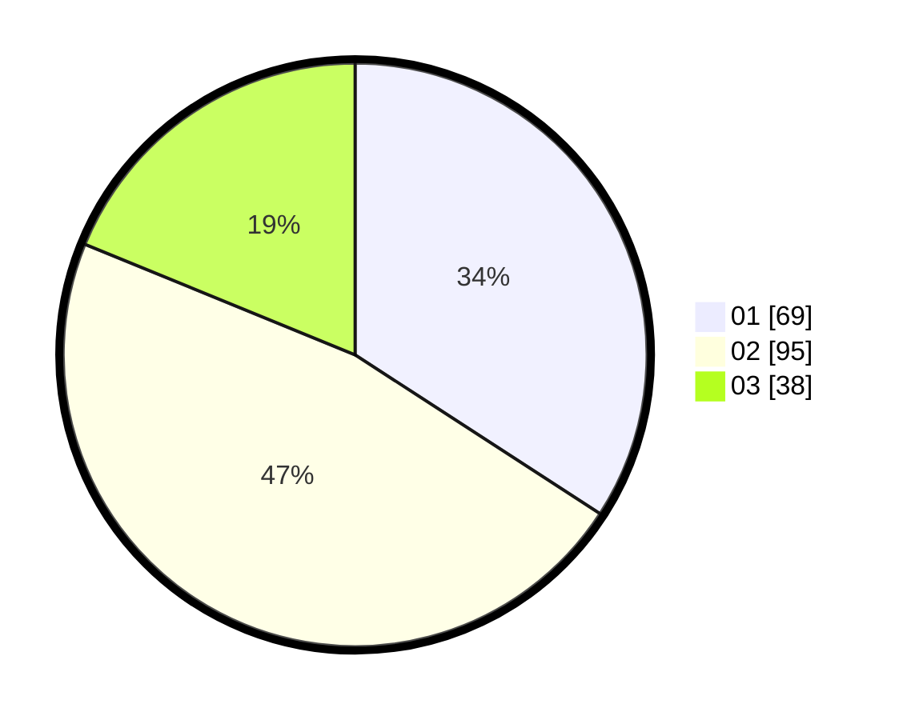

# Hasil

Hasil perolehan suara paslon dapat dilihat pada file paslon-01.txt, paslon-02.txt, dan paslon-03.txt.

Jika tidak ada, artinya data tersebut belum ada pada SIREKAP.

## Perolehan Suara

 * Paslon 01: **69**.
 * Paslon 02: **95**.
 * Paslon 03: **38**.

## Foto C Plano

https://sirekap-obj-formc.kpu.go.id/cdb6/pemilu/ppwp/31/71/02/10/02/3171021002046-20240216-122144--76d23854-5294-48fb-b87a-2946405b7c1c.jpg

https://sirekap-obj-formc.kpu.go.id/cdb6/pemilu/ppwp/31/71/02/10/02/3171021002046-20240216-122148--dbcba7f8-87ac-4afc-9dc2-592e4b91c15a.jpg

https://sirekap-obj-formc.kpu.go.id/cdb6/pemilu/ppwp/31/71/02/10/02/3171021002046-20240216-122145--b272c394-c215-4466-a49b-fdbfa11f3988.jpg

## DATA PEMILIH TETAP

Jumlah pemilih dalam DPT: **263**.
 * L: **123**.
 * P: **140**.

## DATA PENGGUNA HAK PILIH

Jumlah pengguna hak pilih dalam DPT: **206**.
 * L: **98**.
 * P: **108**.

Jumlah pengguna hak pilih dalam DPTb: **1**.
 * L: **1**.
 * P: **0**.

Jumlah pengguna hak pilih dalam DPK: **0**.
 * L: **0**.
 * P: **0**.

Jumlah pengguna hak pilih: **207**.
 * L: **99**.
 * P: **108**.

## JUMLAH SUARA SAH DAN TIDAK SAH

JUMLAH SELURUH SUARA SAH: **202**.

JUMLAH SUARA TIDAK SAH: **5**.

JUMLAH SELURUH SUARA SAH DAN SUARA TIDAK SAH: **207**.
