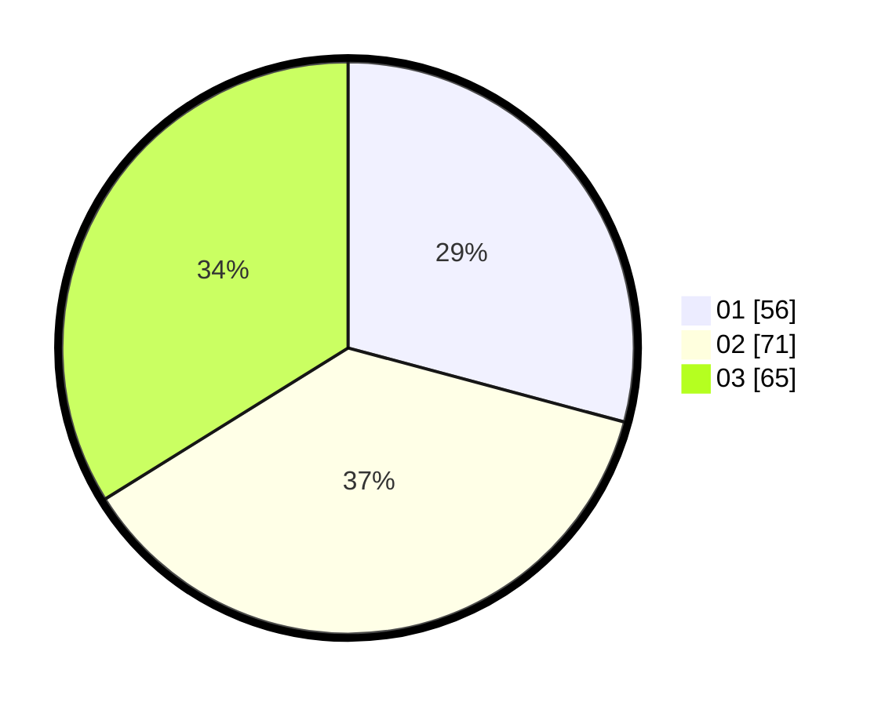

# Hasil

Hasil perolehan suara paslon dapat dilihat pada file paslon-01.txt, paslon-02.txt, dan paslon-03.txt.

Jika tidak ada, artinya data tersebut belum ada pada SIREKAP.

## Perolehan Suara

 * Paslon 01: **56**.
 * Paslon 02: **71**.
 * Paslon 03: **65**.

## Foto C Plano

https://sirekap-obj-formc.kpu.go.id/5c41/pemilu/ppwp/31/71/02/10/02/3171021002051-20240216-135202--4685388e-35c2-4b89-a852-8684d78e6a4f.jpg

https://sirekap-obj-formc.kpu.go.id/5c41/pemilu/ppwp/31/71/02/10/02/3171021002051-20240216-135203--d03b55cf-a876-4cbe-a229-fb7ad988c4fb.jpg

https://sirekap-obj-formc.kpu.go.id/5c41/pemilu/ppwp/31/71/02/10/02/3171021002051-20240216-135202--3c26e2a5-e695-41bf-b70c-bd7c3b6fa9e2.jpg

## DATA PEMILIH TETAP

Jumlah pemilih dalam DPT: **273**.
 * L: **136**.
 * P: **137**.

## DATA PENGGUNA HAK PILIH

Jumlah pengguna hak pilih dalam DPT: **191**.
 * L: **90**.
 * P: **101**.

Jumlah pengguna hak pilih dalam DPTb: **1**.
 * L: **1**.
 * P: **0**.

Jumlah pengguna hak pilih dalam DPK: **1**.
 * L: **1**.
 * P: **0**.

Jumlah pengguna hak pilih: **193**.
 * L: **92**.
 * P: **101**.

## JUMLAH SUARA SAH DAN TIDAK SAH

JUMLAH SELURUH SUARA SAH: **192**.

JUMLAH SUARA TIDAK SAH: **1**.

JUMLAH SELURUH SUARA SAH DAN SUARA TIDAK SAH: **193**.
