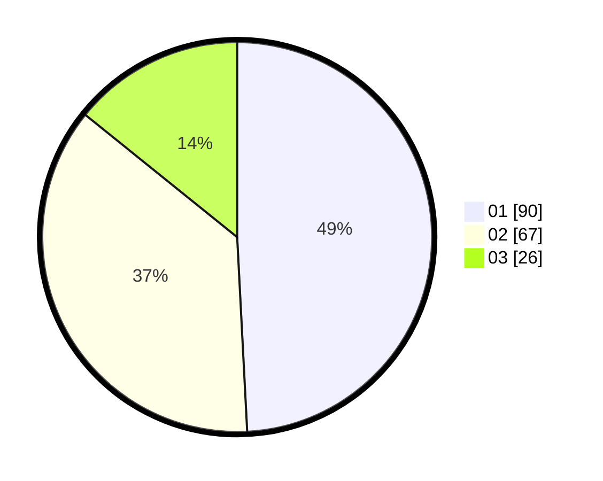

# Hasil

Hasil perolehan suara paslon dapat dilihat pada file paslon-01.txt, paslon-02.txt, dan paslon-03.txt.

Jika tidak ada, artinya data tersebut belum ada pada SIREKAP.

## Perolehan Suara

 * Paslon 01: **90**.
 * Paslon 02: **67**.
 * Paslon 03: **26**.

## Foto C Plano

https://sirekap-obj-formc.kpu.go.id/06d3/pemilu/ppwp/31/71/02/10/02/3171021002052-20240216-161354--529ef00e-42b3-4f04-a955-ba19f03b2ecf.jpg

https://sirekap-obj-formc.kpu.go.id/06d3/pemilu/ppwp/31/71/02/10/02/3171021002052-20240216-161355--64083233-aa99-4788-a5b9-b31609f3b126.jpg

https://sirekap-obj-formc.kpu.go.id/06d3/pemilu/ppwp/31/71/02/10/02/3171021002052-20240216-161355--776245b6-763c-4312-8937-33ce24ab3666.jpg

## DATA PEMILIH TETAP

Jumlah pemilih dalam DPT: **260**.
 * L: **138**.
 * P: **122**.

## DATA PENGGUNA HAK PILIH

Jumlah pengguna hak pilih dalam DPT: **183**.
 * L: **97**.
 * P: **86**.

Jumlah pengguna hak pilih dalam DPTb: **0**.
 * L: **0**.
 * P: **0**.

Jumlah pengguna hak pilih dalam DPK: **2**.
 * L: **0**.
 * P: **2**.

Jumlah pengguna hak pilih: **185**.
 * L: **97**.
 * P: **88**.

## JUMLAH SUARA SAH DAN TIDAK SAH

JUMLAH SELURUH SUARA SAH: **183**.

JUMLAH SUARA TIDAK SAH: **2**.

JUMLAH SELURUH SUARA SAH DAN SUARA TIDAK SAH: **185**.
