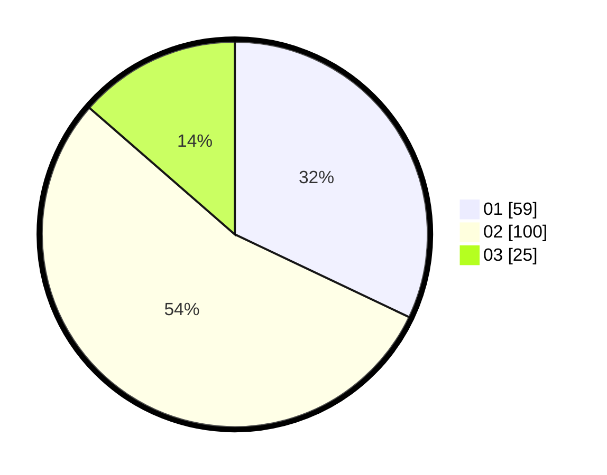

# Hasil

Hasil perolehan suara paslon dapat dilihat pada file paslon-01.txt, paslon-02.txt, dan paslon-03.txt.

Jika tidak ada, artinya data tersebut belum ada pada SIREKAP.

## Perolehan Suara

 * Paslon 01: **59**.
 * Paslon 02: **100**.
 * Paslon 03: **25**.

## Foto C Plano

https://sirekap-obj-formc.kpu.go.id/5268/pemilu/ppwp/31/71/02/10/02/3171021002053-20240216-153129--dd7f6165-4e0b-4c21-8e6e-acd9822bd774.jpg

https://sirekap-obj-formc.kpu.go.id/5268/pemilu/ppwp/31/71/02/10/02/3171021002053-20240216-153130--6052c3b0-e7f5-4ea5-8da4-412f4b7272a1.jpg

https://sirekap-obj-formc.kpu.go.id/5268/pemilu/ppwp/31/71/02/10/02/3171021002053-20240216-153130--a25abed1-0eaa-4de5-9d27-9a3e3479f483.jpg

## DATA PEMILIH TETAP

Jumlah pemilih dalam DPT: **275**.
 * L: **150**.
 * P: **125**.

## DATA PENGGUNA HAK PILIH

Jumlah pengguna hak pilih dalam DPT: **183**.
 * L: **102**.
 * P: **81**.

Jumlah pengguna hak pilih dalam DPTb: **1**.
 * L: **1**.
 * P: **0**.

Jumlah pengguna hak pilih dalam DPK: **0**.
 * L: **0**.
 * P: **0**.

Jumlah pengguna hak pilih: **184**.
 * L: **103**.
 * P: **81**.

## JUMLAH SUARA SAH DAN TIDAK SAH

JUMLAH SELURUH SUARA SAH: **184**.

JUMLAH SUARA TIDAK SAH: **0**.

JUMLAH SELURUH SUARA SAH DAN SUARA TIDAK SAH: **184**.
