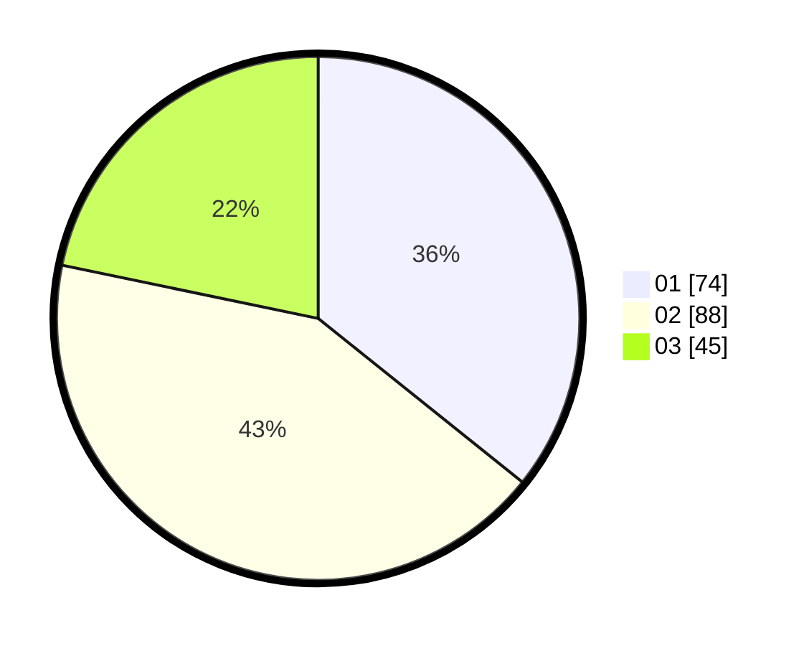

# Hasil

Hasil perolehan suara paslon dapat dilihat pada file paslon-01.txt, paslon-02.txt, dan paslon-03.txt.

Jika tidak ada, artinya data tersebut belum ada pada SIREKAP.

## Perolehan Suara

 * Paslon 01: **74**.
 * Paslon 02: **88**.
 * Paslon 03: **45**.

## Foto C Plano

https://sirekap-obj-formc.kpu.go.id/e29f/pemilu/ppwp/31/71/02/10/02/3171021002054-20240214-234251--e7089c89-a159-4ca5-9afe-e496b8372394.jpg

https://sirekap-obj-formc.kpu.go.id/e29f/pemilu/ppwp/31/71/02/10/02/3171021002054-20240214-234554--44f7100e-122e-4d22-b590-f91484b8ecf9.jpg

https://sirekap-obj-formc.kpu.go.id/e29f/pemilu/ppwp/31/71/02/10/02/3171021002054-20240214-234738--cc621560-a111-42fc-abcd-6462be6b7176.jpg

## DATA PEMILIH TETAP

Jumlah pemilih dalam DPT: **289**.
 * L: **141**.
 * P: **148**.

## DATA PENGGUNA HAK PILIH

Jumlah pengguna hak pilih dalam DPT: **203**.
 * L: **98**.
 * P: **105**.

Jumlah pengguna hak pilih dalam DPTb: **4**.
 * L: **1**.
 * P: **3**.

Jumlah pengguna hak pilih dalam DPK: **3**.
 * L: **2**.
 * P: **1**.

Jumlah pengguna hak pilih: **210**.
 * L: **101**.
 * P: **109**.

## JUMLAH SUARA SAH DAN TIDAK SAH

JUMLAH SELURUH SUARA SAH: **207**.

JUMLAH SUARA TIDAK SAH: **3**.

JUMLAH SELURUH SUARA SAH DAN SUARA TIDAK SAH: **210**.
