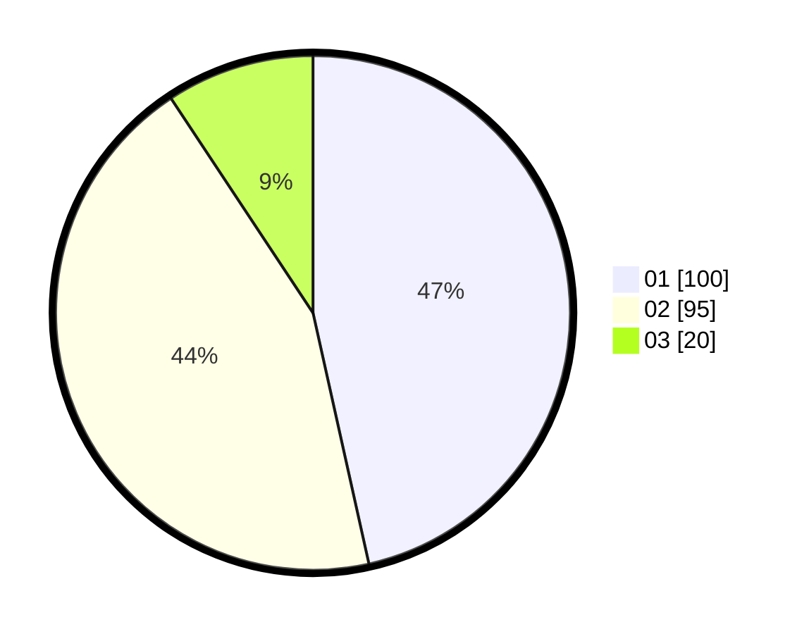

# Hasil

Hasil perolehan suara paslon dapat dilihat pada file paslon-01.txt, paslon-02.txt, dan paslon-03.txt.

Jika tidak ada, artinya data tersebut belum ada pada SIREKAP.

## Perolehan Suara

 * Paslon 01: **100**.
 * Paslon 02: **95**.
 * Paslon 03: **20**.

## Foto C Plano

https://sirekap-obj-formc.kpu.go.id/6273/pemilu/ppwp/31/71/02/10/02/3171021002058-20240217-111449--e5040551-42ed-4434-83a8-f70b47cfd097.jpg

https://sirekap-obj-formc.kpu.go.id/6273/pemilu/ppwp/31/71/02/10/02/3171021002058-20240217-111450--570f3a8e-2c2a-4d66-86bd-e1802eb2366e.jpg

https://sirekap-obj-formc.kpu.go.id/6273/pemilu/ppwp/31/71/02/10/02/3171021002058-20240217-111449--c079b7c8-452f-4a16-8528-752b184de54b.jpg

## DATA PEMILIH TETAP

Jumlah pemilih dalam DPT: **289**.
 * L: **147**.
 * P: **142**.

## DATA PENGGUNA HAK PILIH

Jumlah pengguna hak pilih dalam DPT: **210**.
 * L: **107**.
 * P: **103**.

Jumlah pengguna hak pilih dalam DPTb: **5**.
 * L: **4**.
 * P: **1**.

Jumlah pengguna hak pilih dalam DPK: **1**.
 * L: **0**.
 * P: **1**.

Jumlah pengguna hak pilih: **216**.
 * L: **111**.
 * P: **105**.

## JUMLAH SUARA SAH DAN TIDAK SAH

JUMLAH SELURUH SUARA SAH: **215**.

JUMLAH SUARA TIDAK SAH: **1**.

JUMLAH SELURUH SUARA SAH DAN SUARA TIDAK SAH: **216**.
