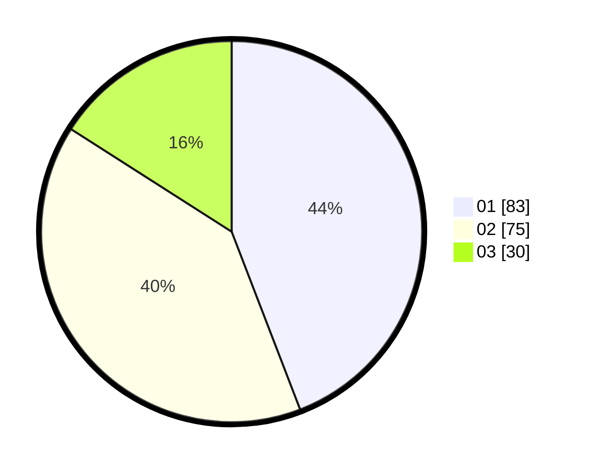

# Hasil

Hasil perolehan suara paslon dapat dilihat pada file paslon-01.txt, paslon-02.txt, dan paslon-03.txt.

Jika tidak ada, artinya data tersebut belum ada pada SIREKAP.

## Perolehan Suara

 * Paslon 01: **83**.
 * Paslon 02: **75**.
 * Paslon 03: **30**.

## Foto C Plano

https://sirekap-obj-formc.kpu.go.id/e8ce/pemilu/ppwp/31/71/02/10/02/3171021002061-20240214-223828--04f17b76-69d3-43e8-96f7-4f95fae26ed2.jpg

https://sirekap-obj-formc.kpu.go.id/e8ce/pemilu/ppwp/31/71/02/10/02/3171021002061-20240215-021031--7cb2a77a-b17f-4500-a9cd-aa36c587aaf1.jpg

https://sirekap-obj-formc.kpu.go.id/e8ce/pemilu/ppwp/31/71/02/10/02/3171021002061-20240215-005238--2454e6f5-ea49-4ed6-8dab-8b169d5ff0e0.jpg
