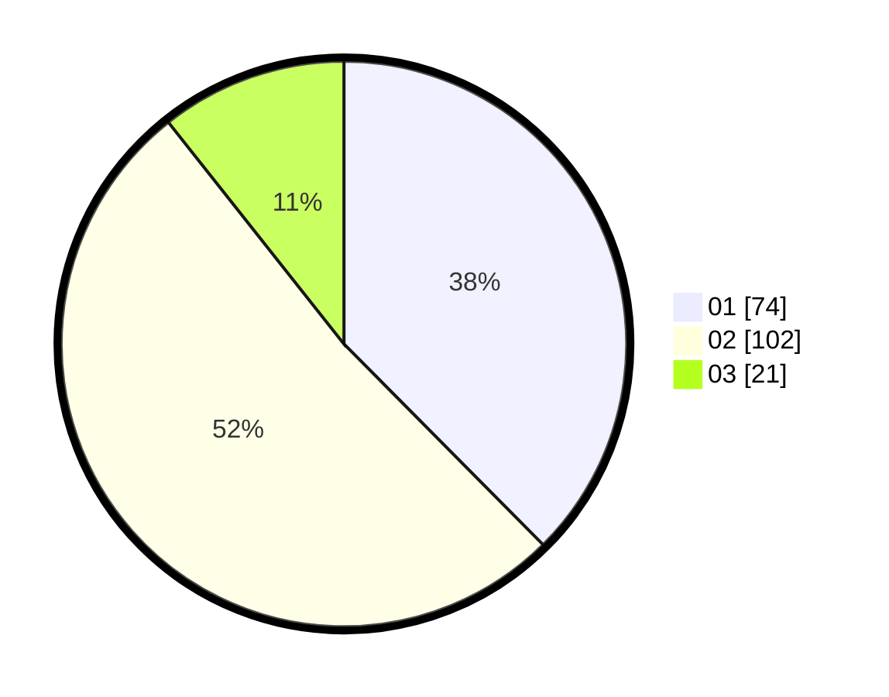

# Hasil

Hasil perolehan suara paslon dapat dilihat pada file paslon-01.txt, paslon-02.txt, dan paslon-03.txt.

Jika tidak ada, artinya data tersebut belum ada pada SIREKAP.

## Perolehan Suara

 * Paslon 01: **74**.
 * Paslon 02: **102**.
 * Paslon 03: **21**.

## Foto C Plano

https://sirekap-obj-formc.kpu.go.id/2f4e/pemilu/ppwp/31/71/02/10/02/3171021002062-20240214-235104--eb3f0b39-2c25-431c-acdc-c7a9af181e38.jpg

https://sirekap-obj-formc.kpu.go.id/2f4e/pemilu/ppwp/31/71/02/10/02/3171021002062-20240216-195303--65141598-6bd0-46bf-aa82-f18537466f4e.jpg
