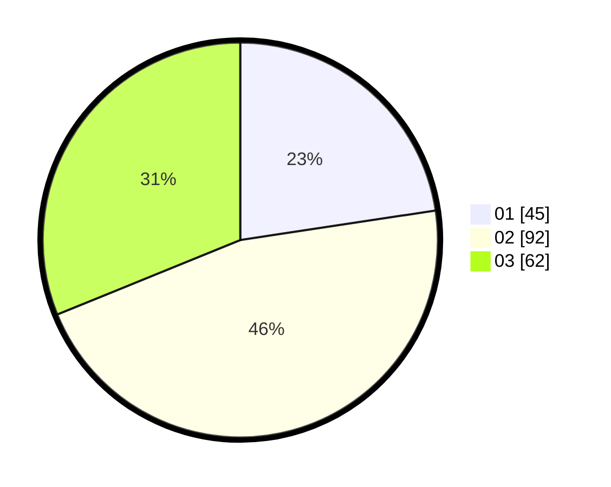

# Hasil

Hasil perolehan suara paslon dapat dilihat pada file paslon-01.txt, paslon-02.txt, dan paslon-03.txt.

Jika tidak ada, artinya data tersebut belum ada pada SIREKAP.

## Perolehan Suara

 * Paslon 01: **45**.
 * Paslon 02: **92**.
 * Paslon 03: **62**.

## Foto C Plano

https://sirekap-obj-formc.kpu.go.id/a639/pemilu/ppwp/31/71/02/10/02/3171021002063-20240216-122618--feb13c89-4669-45f6-9a78-454feb99dc30.jpg

https://sirekap-obj-formc.kpu.go.id/a639/pemilu/ppwp/31/71/02/10/02/3171021002063-20240216-122620--36ce55ab-8992-4160-9948-d59e65265f0e.jpg

https://sirekap-obj-formc.kpu.go.id/a639/pemilu/ppwp/31/71/02/10/02/3171021002063-20240216-122619--0e3e74a4-756f-47bc-a026-c29085f242c1.jpg

## DATA PEMILIH TETAP

Jumlah pemilih dalam DPT: **263**.
 * L: **121**.
 * P: **142**.

## DATA PENGGUNA HAK PILIH

Jumlah pengguna hak pilih dalam DPT: **198**.
 * L: **92**.
 * P: **106**.

Jumlah pengguna hak pilih dalam DPTb: **2**.
 * L: **1**.
 * P: **1**.

Jumlah pengguna hak pilih dalam DPK: **1**.
 * L: **1**.
 * P: **0**.

Jumlah pengguna hak pilih: **201**.
 * L: **94**.
 * P: **107**.

## JUMLAH SUARA SAH DAN TIDAK SAH

JUMLAH SELURUH SUARA SAH: **199**.

JUMLAH SUARA TIDAK SAH: **2**.

JUMLAH SELURUH SUARA SAH DAN SUARA TIDAK SAH: **201**.
