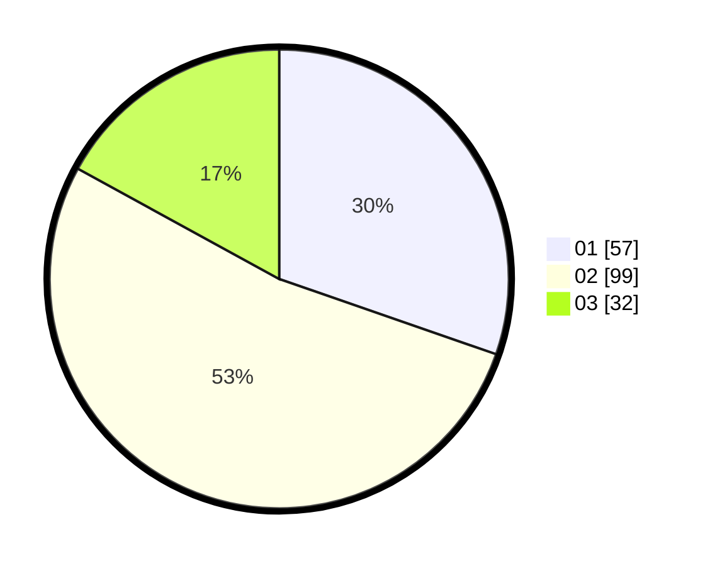

# Hasil

Hasil perolehan suara paslon dapat dilihat pada file paslon-01.txt, paslon-02.txt, dan paslon-03.txt.

Jika tidak ada, artinya data tersebut belum ada pada SIREKAP.

## Perolehan Suara

 * Paslon 01: **57**.
 * Paslon 02: **99**.
 * Paslon 03: **32**.

## Foto C Plano

https://sirekap-obj-formc.kpu.go.id/daec/pemilu/ppwp/31/71/02/10/02/3171021002064-20240216-150402--ee52b803-06ef-4da8-ac13-b8cb228d9b32.jpg

https://sirekap-obj-formc.kpu.go.id/daec/pemilu/ppwp/31/71/02/10/02/3171021002064-20240216-150403--cb9fbbc0-1de3-414c-b238-7f21ef7bcf41.jpg

https://sirekap-obj-formc.kpu.go.id/daec/pemilu/ppwp/31/71/02/10/02/3171021002064-20240216-150402--b0a57298-32ae-4970-8e7b-2a764608134b.jpg

## DATA PEMILIH TETAP

Jumlah pemilih dalam DPT: **163**.
 * L: **135**.
 * P: **128**.

## DATA PENGGUNA HAK PILIH

Jumlah pengguna hak pilih dalam DPT: **184**.
 * L: **96**.
 * P: **88**.

Jumlah pengguna hak pilih dalam DPTb: **6**.
 * L: **4**.
 * P: **2**.

Jumlah pengguna hak pilih dalam DPK: **3**.
 * L: **1**.
 * P: **2**.

Jumlah pengguna hak pilih: **193**.
 * L: **101**.
 * P: **92**.

## JUMLAH SUARA SAH DAN TIDAK SAH

JUMLAH SELURUH SUARA SAH: **188**.

JUMLAH SUARA TIDAK SAH: **5**.

JUMLAH SELURUH SUARA SAH DAN SUARA TIDAK SAH: **193**.
