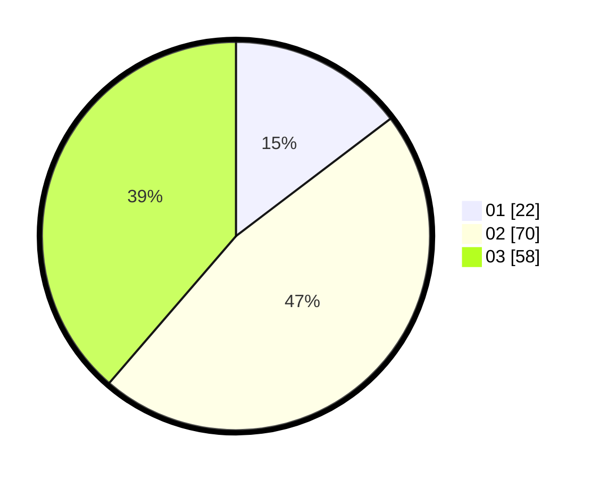

# Hasil

Hasil perolehan suara paslon dapat dilihat pada file paslon-01.txt, paslon-02.txt, dan paslon-03.txt.

Jika tidak ada, artinya data tersebut belum ada pada SIREKAP.

## Perolehan Suara

 * Paslon 01: **22**.
 * Paslon 02: **70**.
 * Paslon 03: **58**.

## Foto C Plano

https://sirekap-obj-formc.kpu.go.id/1af4/pemilu/ppwp/31/71/02/10/02/3171021002069-20240216-041419--51641b85-009d-41d1-a141-2b62ba9bd5d0.jpg

https://sirekap-obj-formc.kpu.go.id/1af4/pemilu/ppwp/31/71/02/10/02/3171021002069-20240216-041429--49d2a24b-a468-4831-8d91-77f9139893d3.jpg

https://sirekap-obj-formc.kpu.go.id/1af4/pemilu/ppwp/31/71/02/10/02/3171021002069-20240216-041425--592ca1c4-e234-42ba-9498-5f15318a06d4.jpg

## DATA PEMILIH TETAP

Jumlah pemilih dalam DPT: **275**.
 * L: **118**.
 * P: **157**.

## DATA PENGGUNA HAK PILIH

Jumlah pengguna hak pilih dalam DPT: **145**.
 * L: **69**.
 * P: **76**.

Jumlah pengguna hak pilih dalam DPTb: **7**.
 * L: **3**.
 * P: **4**.

Jumlah pengguna hak pilih dalam DPK: **1**.
 * L: **1**.
 * P: **0**.

Jumlah pengguna hak pilih: **153**.
 * L: **73**.
 * P: **80**.

## JUMLAH SUARA SAH DAN TIDAK SAH

JUMLAH SELURUH SUARA SAH: **150**.

JUMLAH SUARA TIDAK SAH: **3**.

JUMLAH SELURUH SUARA SAH DAN SUARA TIDAK SAH: **153**.
