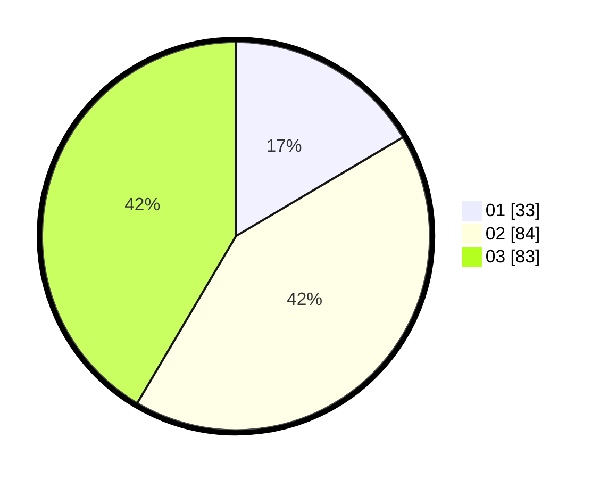

# Hasil

Hasil perolehan suara paslon dapat dilihat pada file paslon-01.txt, paslon-02.txt, dan paslon-03.txt.

Jika tidak ada, artinya data tersebut belum ada pada SIREKAP.

## Perolehan Suara

 * Paslon 01: **33**.
 * Paslon 02: **84**.
 * Paslon 03: **83**.

## Foto C Plano

https://sirekap-obj-formc.kpu.go.id/0c17/pemilu/ppwp/31/71/02/10/02/3171021002071-20240216-132729--0603c505-7114-4e69-81e5-9b42d0b19b50.jpg

https://sirekap-obj-formc.kpu.go.id/0c17/pemilu/ppwp/31/71/02/10/02/3171021002071-20240216-132730--0b5cccdc-a6ce-4056-b490-8c193fa2d4e7.jpg

https://sirekap-obj-formc.kpu.go.id/0c17/pemilu/ppwp/31/71/02/10/02/3171021002071-20240216-132730--047c6d12-88ab-41d4-b1e0-0f07232f3f18.jpg

## DATA PEMILIH TETAP

Jumlah pemilih dalam DPT: **281**.
 * L: **124**.
 * P: **157**.

## DATA PENGGUNA HAK PILIH

Jumlah pengguna hak pilih dalam DPT: **185**.
 * L: **79**.
 * P: **106**.

Jumlah pengguna hak pilih dalam DPTb: **9**.
 * L: **7**.
 * P: **2**.

Jumlah pengguna hak pilih dalam DPK: **8**.
 * L: **3**.
 * P: **5**.

Jumlah pengguna hak pilih: **202**.
 * L: **89**.
 * P: **113**.

## JUMLAH SUARA SAH DAN TIDAK SAH

JUMLAH SELURUH SUARA SAH: **200**.

JUMLAH SUARA TIDAK SAH: **2**.

JUMLAH SELURUH SUARA SAH DAN SUARA TIDAK SAH: **202**.
