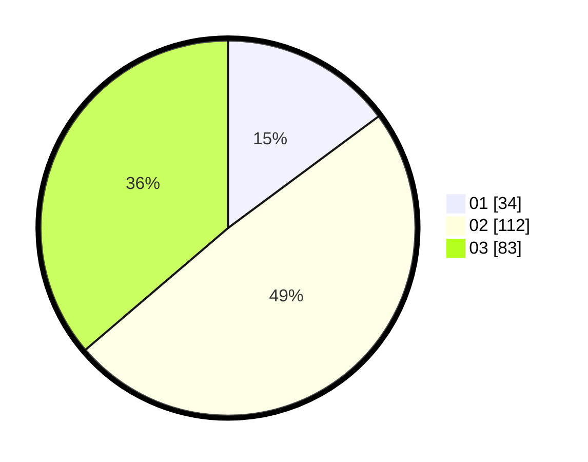

# Hasil

Hasil perolehan suara paslon dapat dilihat pada file paslon-01.txt, paslon-02.txt, dan paslon-03.txt.

Jika tidak ada, artinya data tersebut belum ada pada SIREKAP.

## Perolehan Suara

 * Paslon 01: **34**.
 * Paslon 02: **112**.
 * Paslon 03: **83**.

## Foto C Plano

https://sirekap-obj-formc.kpu.go.id/6f32/pemilu/ppwp/31/71/02/10/02/3171021002072-20240216-115342--526c9c01-c218-46e4-9af6-f648ba99ff14.jpg

https://sirekap-obj-formc.kpu.go.id/6f32/pemilu/ppwp/31/71/02/10/02/3171021002072-20240216-115343--9db471a1-1cff-46e4-a786-42e8dfea58c3.jpg

https://sirekap-obj-formc.kpu.go.id/6f32/pemilu/ppwp/31/71/02/10/02/3171021002072-20240216-115342--5670ae6c-6d03-4a7c-b176-f7d031a29335.jpg

## DATA PEMILIH TETAP

Jumlah pemilih dalam DPT: **275**.
 * L: **134**.
 * P: **141**.

## DATA PENGGUNA HAK PILIH

Jumlah pengguna hak pilih dalam DPT: **222**.
 * L: **110**.
 * P: **112**.

Jumlah pengguna hak pilih dalam DPTb: **8**.
 * L: **5**.
 * P: **3**.

Jumlah pengguna hak pilih dalam DPK: **4**.
 * L: **2**.
 * P: **2**.

Jumlah pengguna hak pilih: **234**.
 * L: **117**.
 * P: **117**.

## JUMLAH SUARA SAH DAN TIDAK SAH

JUMLAH SELURUH SUARA SAH: **229**.

JUMLAH SUARA TIDAK SAH: **5**.

JUMLAH SELURUH SUARA SAH DAN SUARA TIDAK SAH: **234**.
