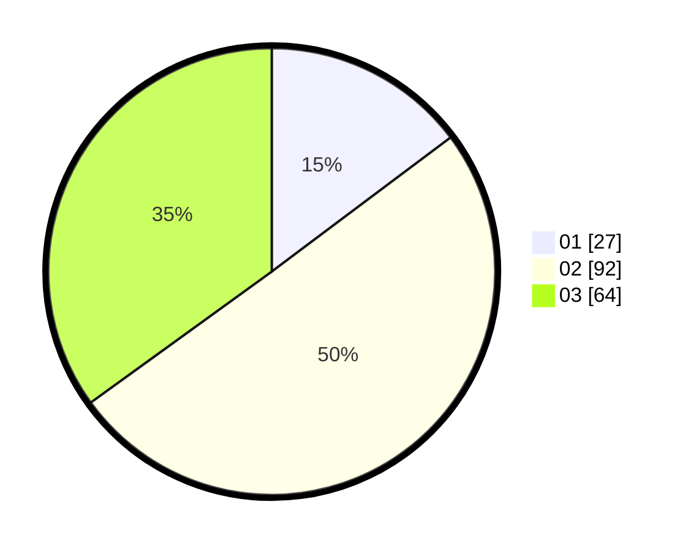

# Hasil

Hasil perolehan suara paslon dapat dilihat pada file paslon-01.txt, paslon-02.txt, dan paslon-03.txt.

Jika tidak ada, artinya data tersebut belum ada pada SIREKAP.

## Perolehan Suara

 * Paslon 01: **27**.
 * Paslon 02: **92**.
 * Paslon 03: **64**.

## Foto C Plano

https://sirekap-obj-formc.kpu.go.id/6aa8/pemilu/ppwp/31/71/02/10/02/3171021002076-20240216-151156--a9c2f48a-3180-4e54-ad2f-369810c6b7b0.jpg

https://sirekap-obj-formc.kpu.go.id/6aa8/pemilu/ppwp/31/71/02/10/02/3171021002076-20240216-151157--ee53c943-95b5-42d6-ae30-14e0309c445e.jpg

https://sirekap-obj-formc.kpu.go.id/6aa8/pemilu/ppwp/31/71/02/10/02/3171021002076-20240216-151156--faed62e7-c1d7-48c5-b9b5-e3d620eef7ae.jpg

## DATA PEMILIH TETAP

Jumlah pemilih dalam DPT: **278**.
 * L: **136**.
 * P: **142**.

## DATA PENGGUNA HAK PILIH

Jumlah pengguna hak pilih dalam DPT: **177**.
 * L: **85**.
 * P: **92**.

Jumlah pengguna hak pilih dalam DPTb: **3**.
 * L: **0**.
 * P: **3**.

Jumlah pengguna hak pilih dalam DPK: **3**.
 * L: **2**.
 * P: **1**.

Jumlah pengguna hak pilih: **183**.
 * L: **87**.
 * P: **96**.

## JUMLAH SUARA SAH DAN TIDAK SAH

JUMLAH SELURUH SUARA SAH: **183**.

JUMLAH SUARA TIDAK SAH: **0**.

JUMLAH SELURUH SUARA SAH DAN SUARA TIDAK SAH: **183**.
