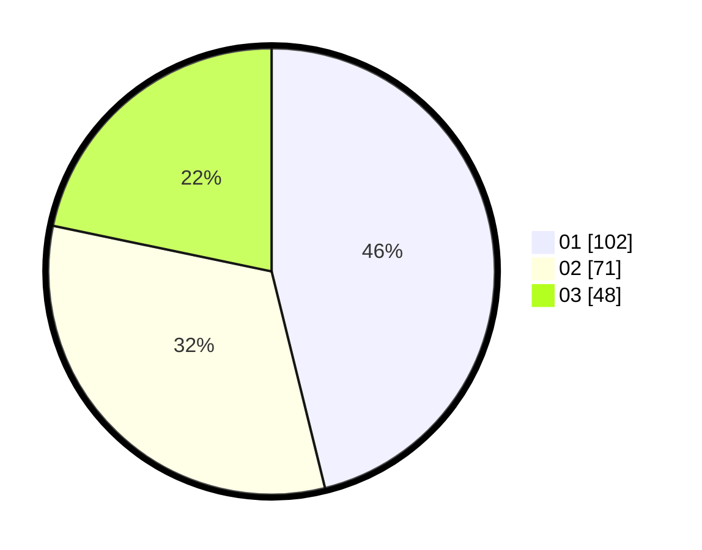

# Hasil

Hasil perolehan suara paslon dapat dilihat pada file paslon-01.txt, paslon-02.txt, dan paslon-03.txt.

Jika tidak ada, artinya data tersebut belum ada pada SIREKAP.

## Perolehan Suara

 * Paslon 01: **102**.
 * Paslon 02: **71**.
 * Paslon 03: **48**.

## Foto C Plano

https://sirekap-obj-formc.kpu.go.id/6fd0/pemilu/ppwp/31/71/02/10/02/3171021002080-20240215-230147--3d410a04-73a9-4514-981f-cb23956aa539.jpg

https://sirekap-obj-formc.kpu.go.id/6fd0/pemilu/ppwp/31/71/02/10/02/3171021002080-20240215-230148--9603ba04-5c11-4370-809f-53ecdce4eb98.jpg

https://sirekap-obj-formc.kpu.go.id/6fd0/pemilu/ppwp/31/71/02/10/02/3171021002080-20240215-230148--4fb2649b-1922-4b09-b9e5-f6003e3c397e.jpg

## DATA PEMILIH TETAP

Jumlah pemilih dalam DPT: **222**.
 * L: **108**.
 * P: **114**.

## DATA PENGGUNA HAK PILIH

Jumlah pengguna hak pilih dalam DPT: **218**.
 * L: **106**.
 * P: **112**.

Jumlah pengguna hak pilih dalam DPTb: **2**.
 * L: **1**.
 * P: **1**.

Jumlah pengguna hak pilih dalam DPK: **2**.
 * L: **1**.
 * P: **1**.

Jumlah pengguna hak pilih: **222**.
 * L: **108**.
 * P: **114**.

## JUMLAH SUARA SAH DAN TIDAK SAH

JUMLAH SELURUH SUARA SAH: **221**.

JUMLAH SUARA TIDAK SAH: **1**.

JUMLAH SELURUH SUARA SAH DAN SUARA TIDAK SAH: **222**.
