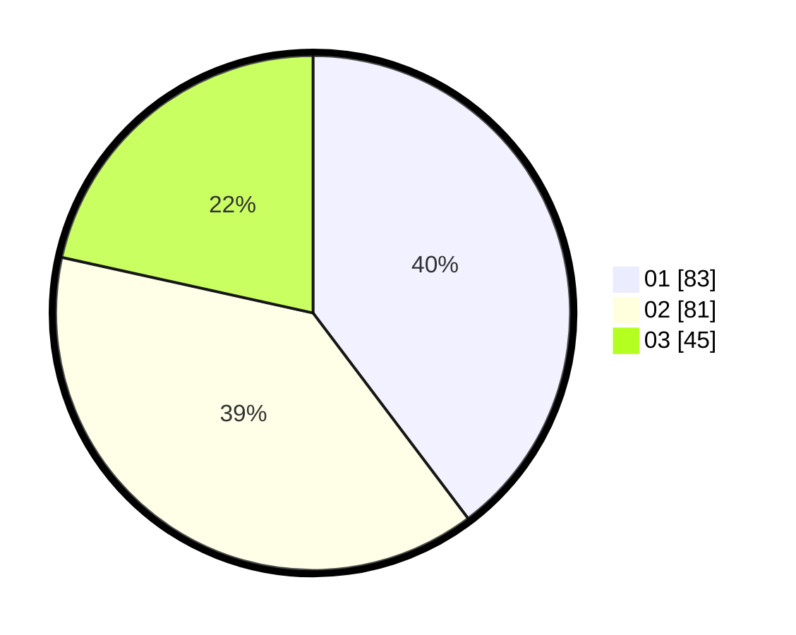

# Hasil

Hasil perolehan suara paslon dapat dilihat pada file paslon-01.txt, paslon-02.txt, dan paslon-03.txt.

Jika tidak ada, artinya data tersebut belum ada pada SIREKAP.

## Perolehan Suara

 * Paslon 01: **83**.
 * Paslon 02: **81**.
 * Paslon 03: **45**.

## Foto C Plano

https://sirekap-obj-formc.kpu.go.id/214f/pemilu/ppwp/31/71/02/10/02/3171021002081-20240216-042505--a489fa8a-3799-480b-8dda-4933cdf9c52e.jpg

https://sirekap-obj-formc.kpu.go.id/214f/pemilu/ppwp/31/71/02/10/02/3171021002081-20240216-042506--04fb5652-f525-4d9f-8375-7aec376c07f3.jpg

https://sirekap-obj-formc.kpu.go.id/214f/pemilu/ppwp/31/71/02/10/02/3171021002081-20240216-042506--d04e586c-10c8-49b3-8454-6876c8281c7b.jpg

## DATA PEMILIH TETAP

Jumlah pemilih dalam DPT: **283**.
 * L: **142**.
 * P: **141**.

## DATA PENGGUNA HAK PILIH

Jumlah pengguna hak pilih dalam DPT: **206**.
 * L: **97**.
 * P: **109**.

Jumlah pengguna hak pilih dalam DPTb: **1**.
 * L: **1**.
 * P: **0**.

Jumlah pengguna hak pilih dalam DPK: **4**.
 * L: **0**.
 * P: **4**.

Jumlah pengguna hak pilih: **211**.
 * L: **98**.
 * P: **113**.

## JUMLAH SUARA SAH DAN TIDAK SAH

JUMLAH SELURUH SUARA SAH: **209**.

JUMLAH SUARA TIDAK SAH: **2**.

JUMLAH SELURUH SUARA SAH DAN SUARA TIDAK SAH: **211**.
