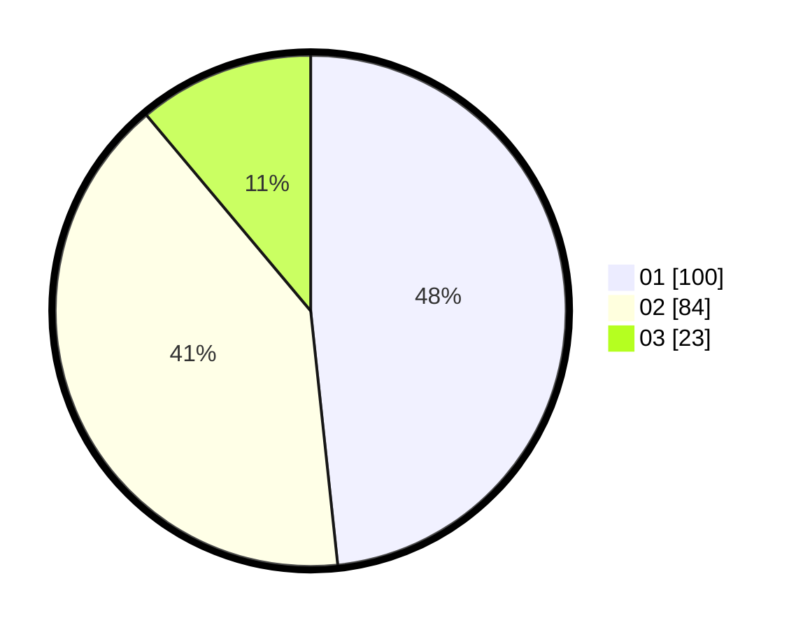

# Hasil

Hasil perolehan suara paslon dapat dilihat pada file paslon-01.txt, paslon-02.txt, dan paslon-03.txt.

Jika tidak ada, artinya data tersebut belum ada pada SIREKAP.

## Perolehan Suara

 * Paslon 01: **100**.
 * Paslon 02: **84**.
 * Paslon 03: **23**.

## Foto C Plano

https://sirekap-obj-formc.kpu.go.id/b9ca/pemilu/ppwp/31/71/02/10/02/3171021002086-20240215-231823--98488719-faad-4304-9d47-bfd0c832833f.jpg

https://sirekap-obj-formc.kpu.go.id/b9ca/pemilu/ppwp/31/71/02/10/02/3171021002086-20240215-231825--405442d7-56af-41f7-b75f-425ec2cc4327.jpg

https://sirekap-obj-formc.kpu.go.id/b9ca/pemilu/ppwp/31/71/02/10/02/3171021002086-20240215-231824--c47cddb3-75ce-4a9d-8bb9-a77cbe1837c8.jpg

## DATA PEMILIH TETAP

Jumlah pemilih dalam DPT: **276**.
 * L: **146**.
 * P: **130**.

## DATA PENGGUNA HAK PILIH

Jumlah pengguna hak pilih dalam DPT: **202**.
 * L: **102**.
 * P: **100**.

Jumlah pengguna hak pilih dalam DPTb: **7**.
 * L: **4**.
 * P: **3**.

Jumlah pengguna hak pilih dalam DPK: **1**.
 * L: **1**.
 * P: **0**.

Jumlah pengguna hak pilih: **210**.
 * L: **107**.
 * P: **103**.

## JUMLAH SUARA SAH DAN TIDAK SAH

JUMLAH SELURUH SUARA SAH: **207**.

JUMLAH SUARA TIDAK SAH: **3**.

JUMLAH SELURUH SUARA SAH DAN SUARA TIDAK SAH: **210**.
