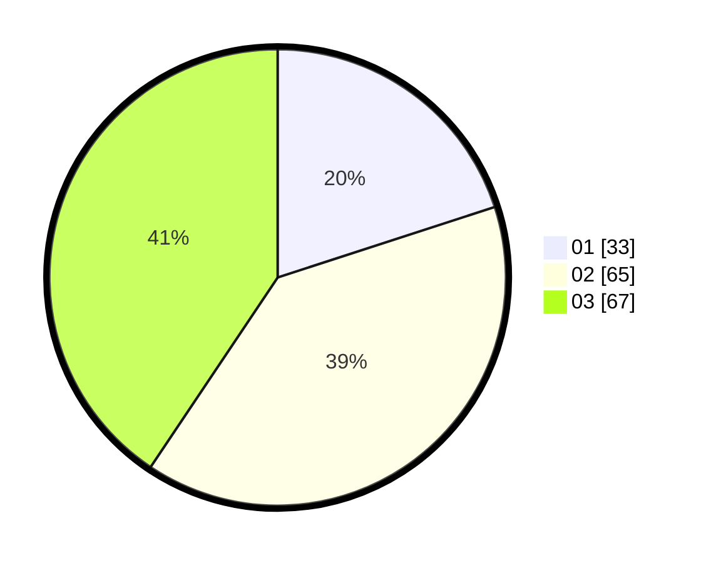

# Hasil

Hasil perolehan suara paslon dapat dilihat pada file paslon-01.txt, paslon-02.txt, dan paslon-03.txt.

Jika tidak ada, artinya data tersebut belum ada pada SIREKAP.

## Perolehan Suara

 * Paslon 01: **33**.
 * Paslon 02: **65**.
 * Paslon 03: **67**.

## Foto C Plano

https://sirekap-obj-formc.kpu.go.id/dd96/pemilu/ppwp/31/71/02/10/03/3171021003002-20240214-194645--d23321eb-179d-4664-afdc-185e35823a21.jpg

https://sirekap-obj-formc.kpu.go.id/dd96/pemilu/ppwp/31/71/02/10/03/3171021003002-20240215-011944--963e2c9e-e03f-44d8-b61b-eb8da38912c3.jpg

https://sirekap-obj-formc.kpu.go.id/dd96/pemilu/ppwp/31/71/02/10/03/3171021003002-20240214-201204--16a68ad3-8498-49aa-9744-cd0af87714c2.jpg

## DATA PEMILIH TETAP

Jumlah pemilih dalam DPT: **265**.
 * L: **129**.
 * P: **136**.

## DATA PENGGUNA HAK PILIH

Jumlah pengguna hak pilih dalam DPT: **159**.
 * L: **79**.
 * P: **80**.

Jumlah pengguna hak pilih dalam DPTb: **1**.
 * L: **1**.
 * P: **0**.

Jumlah pengguna hak pilih dalam DPK: **5**.
 * L: **0**.
 * P: **5**.

Jumlah pengguna hak pilih: **165**.
 * L: **80**.
 * P: **85**.

## JUMLAH SUARA SAH DAN TIDAK SAH

JUMLAH SELURUH SUARA SAH: **165**.

JUMLAH SUARA TIDAK SAH: **3**.

JUMLAH SELURUH SUARA SAH DAN SUARA TIDAK SAH: **168**.
