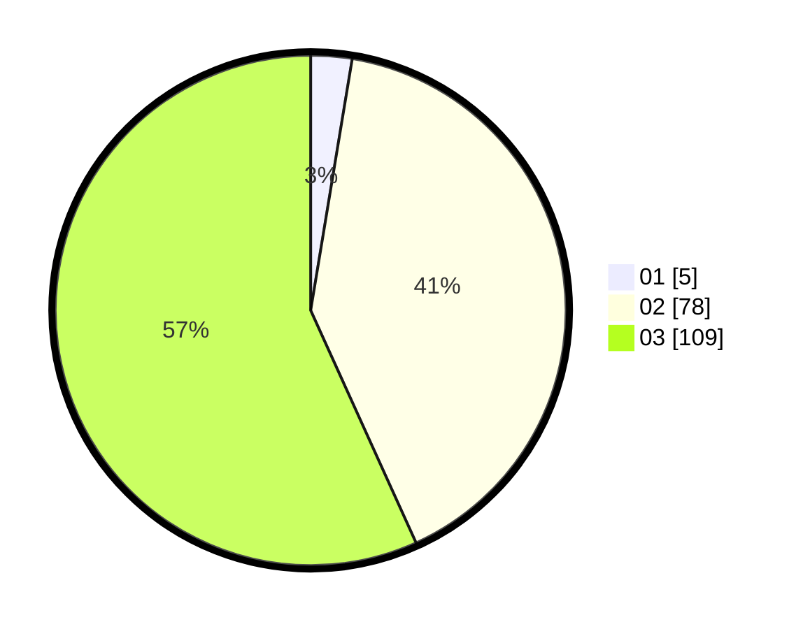

# Hasil

Hasil perolehan suara paslon dapat dilihat pada file paslon-01.txt, paslon-02.txt, dan paslon-03.txt.

Jika tidak ada, artinya data tersebut belum ada pada SIREKAP.

## Perolehan Suara

 * Paslon 01: **5**.
 * Paslon 02: **78**.
 * Paslon 03: **109**.

## Foto C Plano

https://sirekap-obj-formc.kpu.go.id/31a6/pemilu/ppwp/31/71/02/10/03/3171021003003-20240218-104147--d3e83d6e-7f45-45f8-bc05-325ca9bfedc6.jpg

https://sirekap-obj-formc.kpu.go.id/31a6/pemilu/ppwp/31/71/02/10/03/3171021003003-20240218-104013--f8bb58c3-0c44-4985-843d-188060bf7717.jpg

https://sirekap-obj-formc.kpu.go.id/31a6/pemilu/ppwp/31/71/02/10/03/3171021003003-20240218-103716--206bad4d-a0eb-4f0a-b54e-d58db80e5386.jpg

## DATA PEMILIH TETAP

Jumlah pemilih dalam DPT: **183**.
 * L: **84**.
 * P: **99**.

## DATA PENGGUNA HAK PILIH

Jumlah pengguna hak pilih dalam DPT: **183**.
 * L: **84**.
 * P: **99**.

Jumlah pengguna hak pilih dalam DPTb: **4**.
 * L: **3**.
 * P: **1**.

Jumlah pengguna hak pilih dalam DPK: **7**.
 * L: **4**.
 * P: **3**.

Jumlah pengguna hak pilih: **194**.
 * L: **91**.
 * P: **103**.

## JUMLAH SUARA SAH DAN TIDAK SAH

JUMLAH SELURUH SUARA SAH: **192**.

JUMLAH SUARA TIDAK SAH: **2**.

JUMLAH SELURUH SUARA SAH DAN SUARA TIDAK SAH: **194**.
