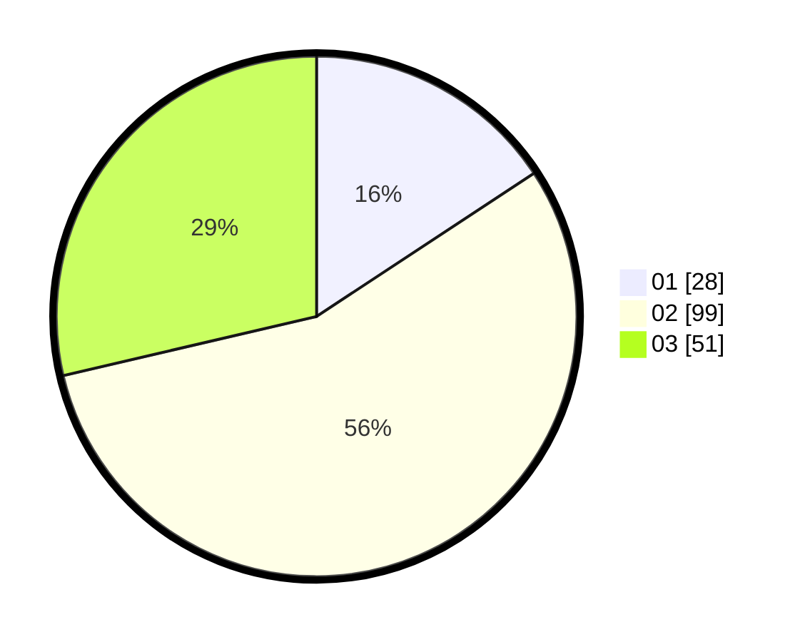

# Hasil

Hasil perolehan suara paslon dapat dilihat pada file paslon-01.txt, paslon-02.txt, dan paslon-03.txt.

Jika tidak ada, artinya data tersebut belum ada pada SIREKAP.

## Perolehan Suara

 * Paslon 01: **28**.
 * Paslon 02: **99**.
 * Paslon 03: **51**.

## Foto C Plano

https://sirekap-obj-formc.kpu.go.id/1537/pemilu/ppwp/31/71/02/10/03/3171021003012-20240216-230327--e5fec509-0212-4352-bea3-18e60a9beb57.jpg

https://sirekap-obj-formc.kpu.go.id/1537/pemilu/ppwp/31/71/02/10/03/3171021003012-20240216-230329--2ff52671-529c-48e6-b655-dca778e05539.jpg

https://sirekap-obj-formc.kpu.go.id/1537/pemilu/ppwp/31/71/02/10/03/3171021003012-20240216-230328--aec037e4-a18e-4d12-8b56-7021856b24cf.jpg

## DATA PEMILIH TETAP

Jumlah pemilih dalam DPT: **282**.
 * L: **143**.
 * P: **139**.

## DATA PENGGUNA HAK PILIH

Jumlah pengguna hak pilih dalam DPT: **181**.
 * L: **89**.
 * P: **92**.

Jumlah pengguna hak pilih dalam DPTb: **0**.
 * L: **0**.
 * P: **0**.

Jumlah pengguna hak pilih dalam DPK: **2**.
 * L: **0**.
 * P: **2**.

Jumlah pengguna hak pilih: **183**.
 * L: **89**.
 * P: **94**.

## JUMLAH SUARA SAH DAN TIDAK SAH

JUMLAH SELURUH SUARA SAH: **178**.

JUMLAH SUARA TIDAK SAH: **5**.

JUMLAH SELURUH SUARA SAH DAN SUARA TIDAK SAH: **183**.
