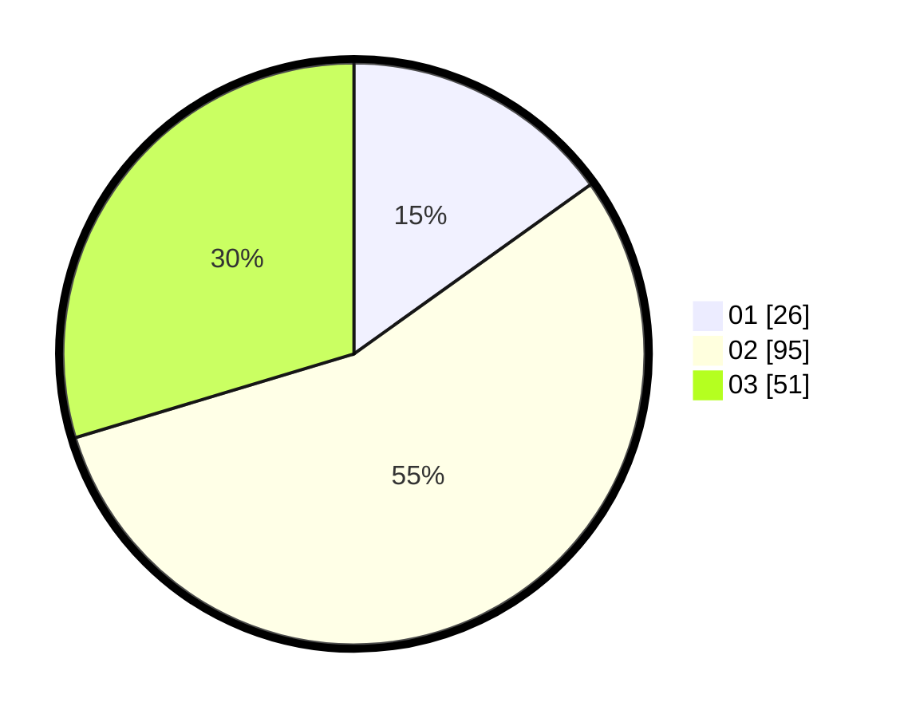

# Hasil

Hasil perolehan suara paslon dapat dilihat pada file paslon-01.txt, paslon-02.txt, dan paslon-03.txt.

Jika tidak ada, artinya data tersebut belum ada pada SIREKAP.

## Perolehan Suara

 * Paslon 01: **26**.
 * Paslon 02: **95**.
 * Paslon 03: **51**.

## Foto C Plano

https://sirekap-obj-formc.kpu.go.id/b488/pemilu/ppwp/31/71/02/10/03/3171021003015-20240218-072719--021fdbc9-be1f-4420-af37-6e1138b08a2c.jpg

https://sirekap-obj-formc.kpu.go.id/b488/pemilu/ppwp/31/71/02/10/03/3171021003015-20240218-073057--813ec4e7-640e-4103-98fd-3603580a650d.jpg

https://sirekap-obj-formc.kpu.go.id/b488/pemilu/ppwp/31/71/02/10/03/3171021003015-20240218-073426--71c9c05b-e1d2-4791-a469-3cf0a755eaf1.jpg

## DATA PEMILIH TETAP

Jumlah pemilih dalam DPT: **244**.
 * L: **123**.
 * P: **121**.

## DATA PENGGUNA HAK PILIH

Jumlah pengguna hak pilih dalam DPT: **173**.
 * L: **83**.
 * P: **90**.

Jumlah pengguna hak pilih dalam DPTb: **2**.
 * L: **0**.
 * P: **2**.

Jumlah pengguna hak pilih dalam DPK: **0**.
 * L: **0**.
 * P: **0**.

Jumlah pengguna hak pilih: **175**.
 * L: **83**.
 * P: **92**.

## JUMLAH SUARA SAH DAN TIDAK SAH

JUMLAH SELURUH SUARA SAH: **172**.

JUMLAH SUARA TIDAK SAH: **3**.

JUMLAH SELURUH SUARA SAH DAN SUARA TIDAK SAH: **175**.
