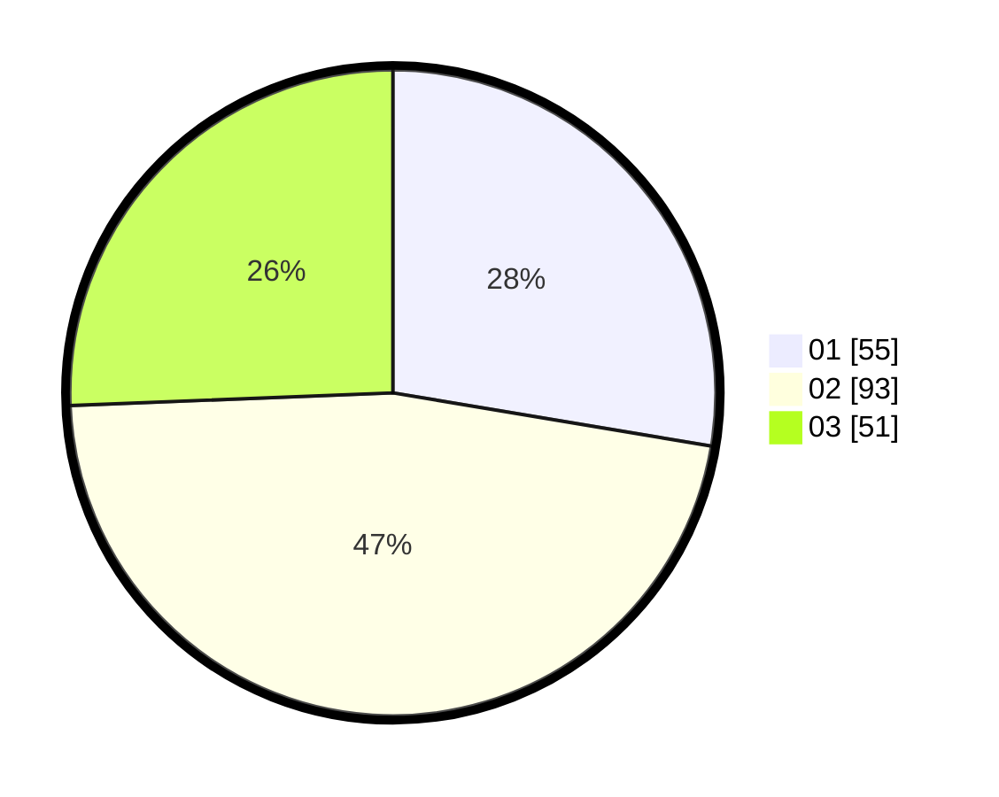

# Hasil

Hasil perolehan suara paslon dapat dilihat pada file paslon-01.txt, paslon-02.txt, dan paslon-03.txt.

Jika tidak ada, artinya data tersebut belum ada pada SIREKAP.

## Perolehan Suara

 * Paslon 01: **55**.
 * Paslon 02: **93**.
 * Paslon 03: **51**.

## Foto C Plano

https://sirekap-obj-formc.kpu.go.id/eb97/pemilu/ppwp/31/71/02/10/03/3171021003022-20240217-170805--7e219802-1bf6-43bd-a6e8-5f1f2d42388c.jpg

https://sirekap-obj-formc.kpu.go.id/eb97/pemilu/ppwp/31/71/02/10/03/3171021003022-20240217-170806--bed32e6f-b325-4fca-8907-4385248010e8.jpg

https://sirekap-obj-formc.kpu.go.id/eb97/pemilu/ppwp/31/71/02/10/03/3171021003022-20240217-170805--f5343f6d-6715-42e6-bbc1-c453f9435c1b.jpg

## DATA PEMILIH TETAP

Jumlah pemilih dalam DPT: **270**.
 * L: **133**.
 * P: **137**.

## DATA PENGGUNA HAK PILIH

Jumlah pengguna hak pilih dalam DPT: **195**.
 * L: **96**.
 * P: **99**.

Jumlah pengguna hak pilih dalam DPTb: **5**.
 * L: **3**.
 * P: **2**.

Jumlah pengguna hak pilih dalam DPK: **2**.
 * L: **1**.
 * P: **1**.

Jumlah pengguna hak pilih: **202**.
 * L: **100**.
 * P: **102**.

## JUMLAH SUARA SAH DAN TIDAK SAH

JUMLAH SELURUH SUARA SAH: **199**.

JUMLAH SUARA TIDAK SAH: **3**.

JUMLAH SELURUH SUARA SAH DAN SUARA TIDAK SAH: **202**.
