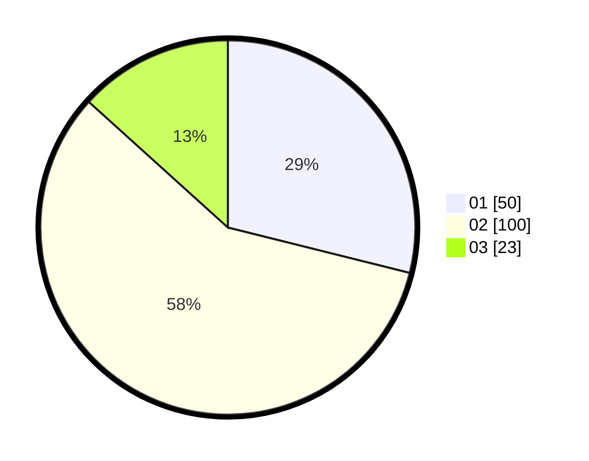

# Hasil

Hasil perolehan suara paslon dapat dilihat pada file paslon-01.txt, paslon-02.txt, dan paslon-03.txt.

Jika tidak ada, artinya data tersebut belum ada pada SIREKAP.

## Perolehan Suara

 * Paslon 01: **50**.
 * Paslon 02: **100**.
 * Paslon 03: **23**.

## Foto C Plano

https://sirekap-obj-formc.kpu.go.id/268c/pemilu/ppwp/31/71/02/10/03/3171021003026-20240216-160148--442dfc91-4e69-4539-bafd-38daa1a0ba3f.jpg

https://sirekap-obj-formc.kpu.go.id/268c/pemilu/ppwp/31/71/02/10/03/3171021003026-20240216-160150--031367d8-b60a-4b1a-8b22-8efee45b125f.jpg

https://sirekap-obj-formc.kpu.go.id/268c/pemilu/ppwp/31/71/02/10/03/3171021003026-20240216-160149--780e8415-be55-4c38-8fc5-3caefe5121d5.jpg

## DATA PEMILIH TETAP

Jumlah pemilih dalam DPT: **263**.
 * L: **132**.
 * P: **131**.

## DATA PENGGUNA HAK PILIH

Jumlah pengguna hak pilih dalam DPT: **176**.
 * L: **82**.
 * P: **94**.

Jumlah pengguna hak pilih dalam DPTb: **0**.
 * L: **0**.
 * P: **0**.

Jumlah pengguna hak pilih dalam DPK: **1**.
 * L: **0**.
 * P: **1**.

Jumlah pengguna hak pilih: **177**.
 * L: **82**.
 * P: **95**.

## JUMLAH SUARA SAH DAN TIDAK SAH

JUMLAH SELURUH SUARA SAH: **173**.

JUMLAH SUARA TIDAK SAH: **4**.

JUMLAH SELURUH SUARA SAH DAN SUARA TIDAK SAH: **177**.
