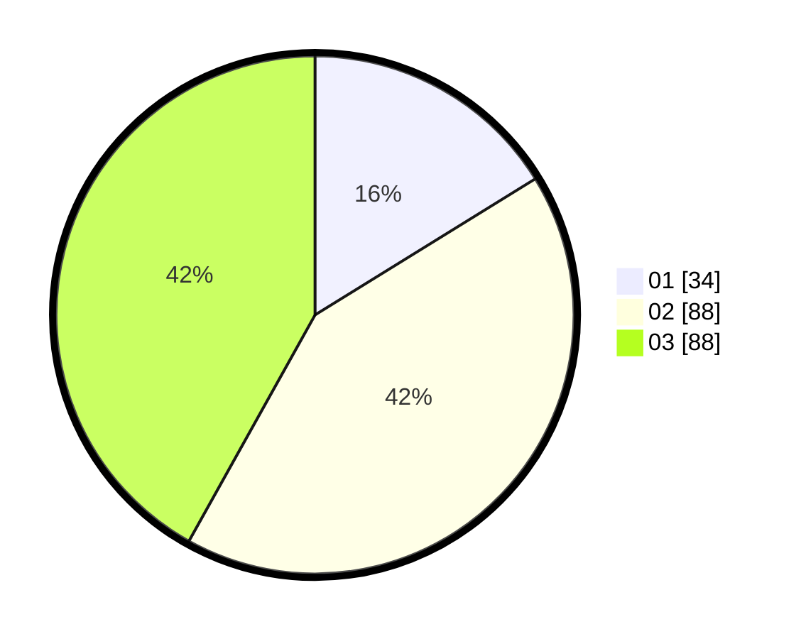

# Hasil

Hasil perolehan suara paslon dapat dilihat pada file paslon-01.txt, paslon-02.txt, dan paslon-03.txt.

Jika tidak ada, artinya data tersebut belum ada pada SIREKAP.

## Perolehan Suara

 * Paslon 01: **34**.
 * Paslon 02: **88**.
 * Paslon 03: **88**.

## Foto C Plano

https://sirekap-obj-formc.kpu.go.id/a69a/pemilu/ppwp/31/71/02/10/03/3171021003027-20240218-203426--b9e353e2-a9a0-4f89-995b-8af4a800fb39.jpg

https://sirekap-obj-formc.kpu.go.id/a69a/pemilu/ppwp/31/71/02/10/03/3171021003027-20240218-135025--1440bcad-b3e5-46c2-bb4b-4b0264c80d2c.jpg

https://sirekap-obj-formc.kpu.go.id/a69a/pemilu/ppwp/31/71/02/10/03/3171021003027-20240218-203608--4a594b8e-3cd2-4f41-b603-405735aa7d6d.jpg
