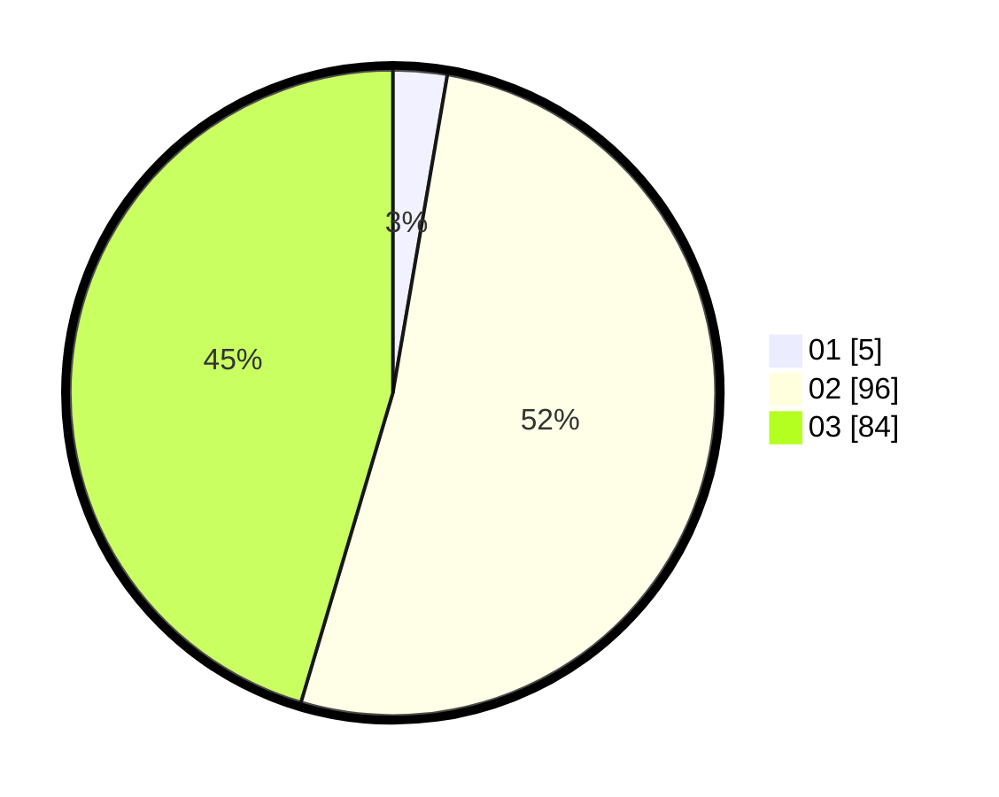

# Hasil

Hasil perolehan suara paslon dapat dilihat pada file paslon-01.txt, paslon-02.txt, dan paslon-03.txt.

Jika tidak ada, artinya data tersebut belum ada pada SIREKAP.

## Perolehan Suara

 * Paslon 01: **5**.
 * Paslon 02: **96**.
 * Paslon 03: **84**.

## Foto C Plano

https://sirekap-obj-formc.kpu.go.id/ada0/pemilu/ppwp/31/71/02/10/03/3171021003028-20240215-205319--9a68e5e3-4ce5-43df-b031-125a1b7e89a0.jpg

https://sirekap-obj-formc.kpu.go.id/ada0/pemilu/ppwp/31/71/02/10/03/3171021003028-20240215-205320--9787fc36-e03e-4ba8-b595-f3199e2f086d.jpg

https://sirekap-obj-formc.kpu.go.id/ada0/pemilu/ppwp/31/71/02/10/03/3171021003028-20240215-205320--fb3e8f7e-b46d-4f24-bf1a-04fa84d3cf9c.jpg

## DATA PEMILIH TETAP

Jumlah pemilih dalam DPT: **289**.
 * L: **135**.
 * P: **154**.

## DATA PENGGUNA HAK PILIH

Jumlah pengguna hak pilih dalam DPT: **185**.
 * L: **86**.
 * P: **99**.

Jumlah pengguna hak pilih dalam DPTb: **2**.
 * L: **2**.
 * P: **0**.

Jumlah pengguna hak pilih dalam DPK: **2**.
 * L: **0**.
 * P: **2**.

Jumlah pengguna hak pilih: **189**.
 * L: **88**.
 * P: **101**.

## JUMLAH SUARA SAH DAN TIDAK SAH

JUMLAH SELURUH SUARA SAH: **185**.

JUMLAH SUARA TIDAK SAH: **4**.

JUMLAH SELURUH SUARA SAH DAN SUARA TIDAK SAH: **189**.
