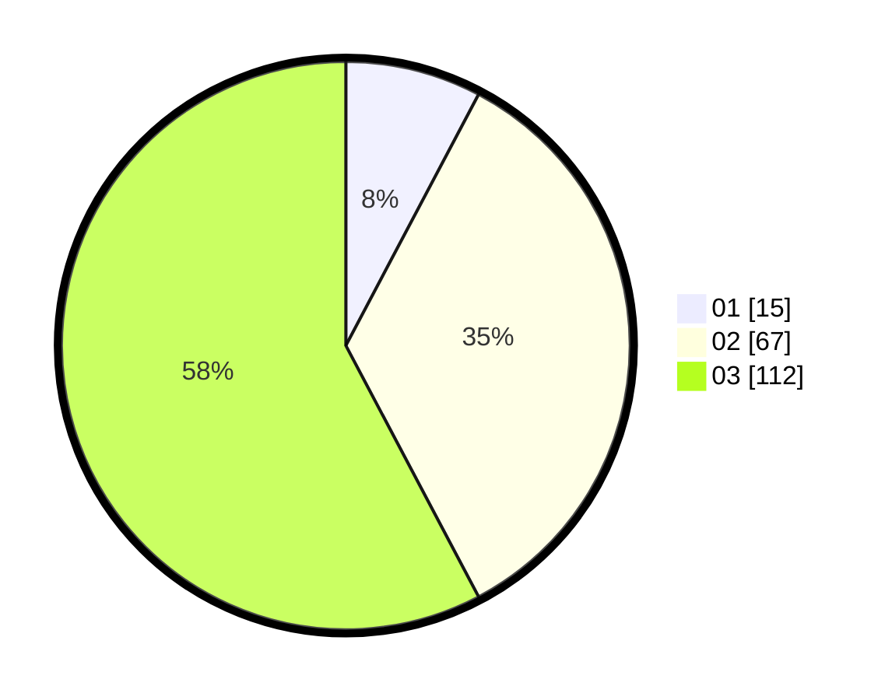

# Hasil

Hasil perolehan suara paslon dapat dilihat pada file paslon-01.txt, paslon-02.txt, dan paslon-03.txt.

Jika tidak ada, artinya data tersebut belum ada pada SIREKAP.

## Perolehan Suara

 * Paslon 01: **15**.
 * Paslon 02: **67**.
 * Paslon 03: **112**.

## Foto C Plano

https://sirekap-obj-formc.kpu.go.id/4b2f/pemilu/ppwp/31/71/02/10/03/3171021003030-20240214-155442--f93bcb58-94cf-47f3-9953-1287883901eb.jpg

https://sirekap-obj-formc.kpu.go.id/4b2f/pemilu/ppwp/31/71/02/10/03/3171021003030-20240214-155735--b9a84618-58f0-4df9-8e19-865b13650e1d.jpg

https://sirekap-obj-formc.kpu.go.id/4b2f/pemilu/ppwp/31/71/02/10/03/3171021003030-20240214-155822--f0557170-c9f1-4d5f-b0bd-bbc2cc591745.jpg

## DATA PEMILIH TETAP

Jumlah pemilih dalam DPT: **265**.
 * L: **131**.
 * P: **134**.

## DATA PENGGUNA HAK PILIH

Jumlah pengguna hak pilih dalam DPT: **190**.
 * L: **95**.
 * P: **95**.

Jumlah pengguna hak pilih dalam DPTb: **2**.
 * L: **0**.
 * P: **2**.

Jumlah pengguna hak pilih dalam DPK: **4**.
 * L: **3**.
 * P: **1**.

Jumlah pengguna hak pilih: **196**.
 * L: **98**.
 * P: **98**.

## JUMLAH SUARA SAH DAN TIDAK SAH

JUMLAH SELURUH SUARA SAH: **194**.

JUMLAH SUARA TIDAK SAH: **2**.

JUMLAH SELURUH SUARA SAH DAN SUARA TIDAK SAH: **196**.
