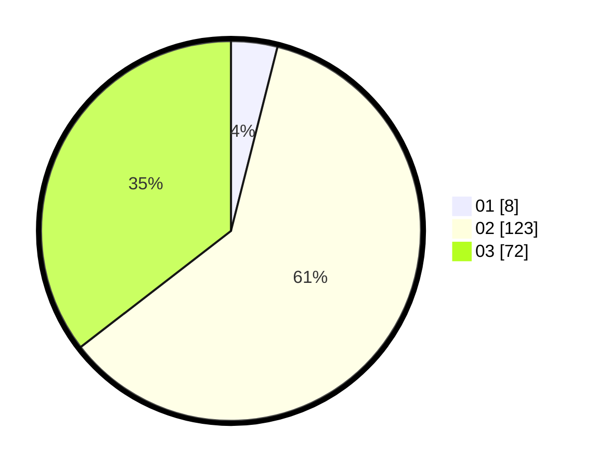

# Hasil

Hasil perolehan suara paslon dapat dilihat pada file paslon-01.txt, paslon-02.txt, dan paslon-03.txt.

Jika tidak ada, artinya data tersebut belum ada pada SIREKAP.

## Perolehan Suara

 * Paslon 01: **8**.
 * Paslon 02: **123**.
 * Paslon 03: **72**.

## Foto C Plano

https://sirekap-obj-formc.kpu.go.id/47f4/pemilu/ppwp/31/71/02/10/03/3171021003033-20240216-184045--924f58f6-861c-474c-97c8-8e8d7250faad.jpg

https://sirekap-obj-formc.kpu.go.id/47f4/pemilu/ppwp/31/71/02/10/03/3171021003033-20240216-184046--f8e70e50-d894-4d97-9003-ee9b9393527c.jpg

https://sirekap-obj-formc.kpu.go.id/47f4/pemilu/ppwp/31/71/02/10/03/3171021003033-20240216-184046--954934ef-deda-45a6-9e77-5b761501134a.jpg

## DATA PEMILIH TETAP

Jumlah pemilih dalam DPT: **291**.
 * L: **140**.
 * P: **151**.

## DATA PENGGUNA HAK PILIH

Jumlah pengguna hak pilih dalam DPT: **198**.
 * L: **93**.
 * P: **105**.

Jumlah pengguna hak pilih dalam DPTb: **2**.
 * L: **1**.
 * P: **1**.

Jumlah pengguna hak pilih dalam DPK: **5**.
 * L: **2**.
 * P: **3**.

Jumlah pengguna hak pilih: **205**.
 * L: **96**.
 * P: **109**.

## JUMLAH SUARA SAH DAN TIDAK SAH

JUMLAH SELURUH SUARA SAH: **203**.

JUMLAH SUARA TIDAK SAH: **2**.

JUMLAH SELURUH SUARA SAH DAN SUARA TIDAK SAH: **205**.
