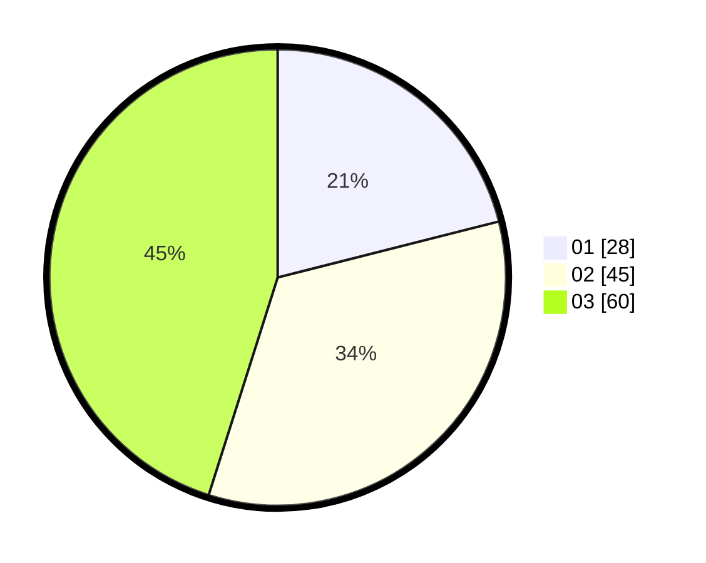

# Hasil

Hasil perolehan suara paslon dapat dilihat pada file paslon-01.txt, paslon-02.txt, dan paslon-03.txt.

Jika tidak ada, artinya data tersebut belum ada pada SIREKAP.

## Perolehan Suara

 * Paslon 01: **28**.
 * Paslon 02: **45**.
 * Paslon 03: **60**.

## Foto C Plano

https://sirekap-obj-formc.kpu.go.id/b791/pemilu/ppwp/31/71/02/10/03/3171021003038-20240218-140839--6ed5654b-c2d4-406a-a2ce-84c0ec97fdbd.jpg

https://sirekap-obj-formc.kpu.go.id/b791/pemilu/ppwp/31/71/02/10/03/3171021003038-20240218-140955--c0af9f83-cc04-4d0f-9624-dba3aa7722d0.jpg

https://sirekap-obj-formc.kpu.go.id/b791/pemilu/ppwp/31/71/02/10/03/3171021003038-20240218-135333--21a0d169-f219-4859-bb74-9f9d21c3a395.jpg

## DATA PEMILIH TETAP

Jumlah pemilih dalam DPT: **248**.
 * L: **776**.
 * P: **832**.

## DATA PENGGUNA HAK PILIH

Jumlah pengguna hak pilih dalam DPT: **976**.
 * L: **88**.
 * P: **88**.

Jumlah pengguna hak pilih dalam DPTb: **888**.
 * L: **8**.
 * P: **886**.

Jumlah pengguna hak pilih dalam DPK: **8**.
 * L: **0**.
 * P: **8**.

Jumlah pengguna hak pilih: **285**.
 * L: **0**.
 * P: **0**.

## JUMLAH SUARA SAH DAN TIDAK SAH

JUMLAH SELURUH SUARA SAH: **183**.

JUMLAH SUARA TIDAK SAH: **2**.

JUMLAH SELURUH SUARA SAH DAN SUARA TIDAK SAH: **185**.
