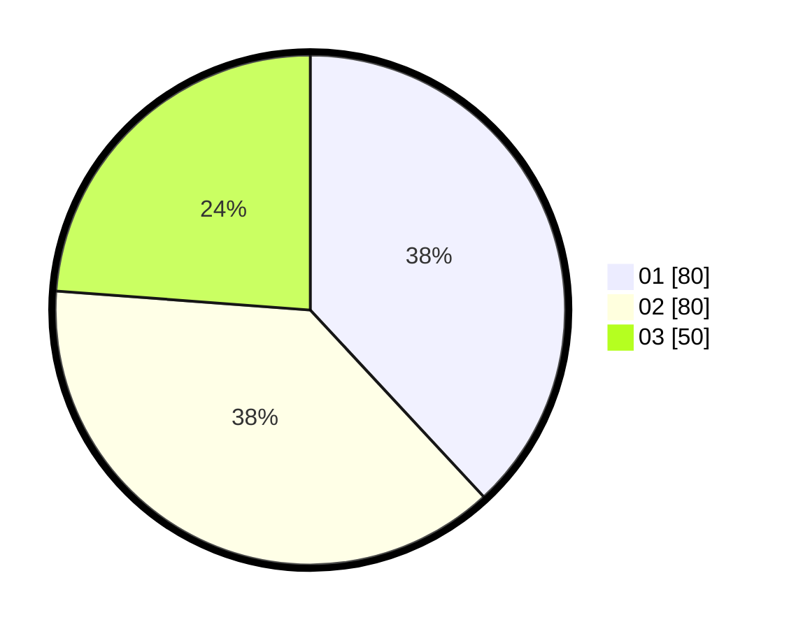

# Hasil

Hasil perolehan suara paslon dapat dilihat pada file paslon-01.txt, paslon-02.txt, dan paslon-03.txt.

Jika tidak ada, artinya data tersebut belum ada pada SIREKAP.

## Perolehan Suara

 * Paslon 01: **80**.
 * Paslon 02: **80**.
 * Paslon 03: **50**.

## Foto C Plano

https://sirekap-obj-formc.kpu.go.id/5ffd/pemilu/ppwp/31/71/02/10/03/3171021003042-20240217-164125--998b58df-cb19-4210-96a9-892831536b11.jpg

https://sirekap-obj-formc.kpu.go.id/5ffd/pemilu/ppwp/31/71/02/10/03/3171021003042-20240217-160006--83f59310-5a67-4b79-b256-36eae172a89a.jpg

https://sirekap-obj-formc.kpu.go.id/5ffd/pemilu/ppwp/31/71/02/10/03/3171021003042-20240217-160222--01970872-9e1b-45ab-b1fe-afa88c6a598d.jpg

## DATA PEMILIH TETAP

Jumlah pemilih dalam DPT: **0**.
 * L: **0**.
 * P: **0**.

## DATA PENGGUNA HAK PILIH

Jumlah pengguna hak pilih dalam DPT: **0**.
 * L: **0**.
 * P: **0**.

Jumlah pengguna hak pilih dalam DPTb: **0**.
 * L: **0**.
 * P: **0**.

Jumlah pengguna hak pilih dalam DPK: **0**.
 * L: **0**.
 * P: **0**.

Jumlah pengguna hak pilih: **0**.
 * L: **0**.
 * P: **0**.

## JUMLAH SUARA SAH DAN TIDAK SAH

JUMLAH SELURUH SUARA SAH: **210**.

JUMLAH SUARA TIDAK SAH: **2**.

JUMLAH SELURUH SUARA SAH DAN SUARA TIDAK SAH: **222**.
