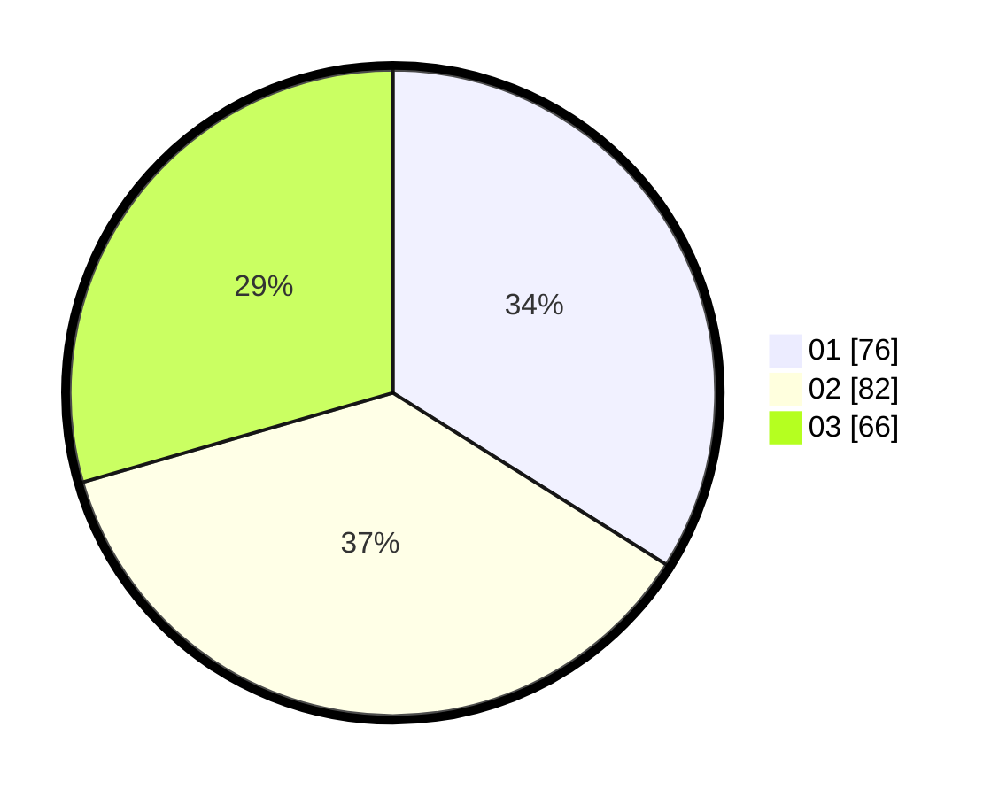

# Hasil

Hasil perolehan suara paslon dapat dilihat pada file paslon-01.txt, paslon-02.txt, dan paslon-03.txt.

Jika tidak ada, artinya data tersebut belum ada pada SIREKAP.

## Perolehan Suara

 * Paslon 01: **76**.
 * Paslon 02: **82**.
 * Paslon 03: **66**.

## Foto C Plano

https://sirekap-obj-formc.kpu.go.id/a6dd/pemilu/ppwp/31/71/02/10/03/3171021003043-20240216-182647--703dd25c-6f9b-48f3-8a44-e200c4207c49.jpg

https://sirekap-obj-formc.kpu.go.id/a6dd/pemilu/ppwp/31/71/02/10/03/3171021003043-20240216-181504--57cc8fff-3801-47ff-853d-c134f97dd306.jpg

https://sirekap-obj-formc.kpu.go.id/a6dd/pemilu/ppwp/31/71/02/10/03/3171021003043-20240216-190122--e0d31fe7-8719-42db-a56d-459ec87c64e2.jpg

## DATA PEMILIH TETAP

Jumlah pemilih dalam DPT: **271**.
 * L: **130**.
 * P: **141**.

## DATA PENGGUNA HAK PILIH

Jumlah pengguna hak pilih dalam DPT: **222**.
 * L: **110**.
 * P: **112**.

Jumlah pengguna hak pilih dalam DPTb: **1**.
 * L: **0**.
 * P: **1**.

Jumlah pengguna hak pilih dalam DPK: **5**.
 * L: **3**.
 * P: **2**.

Jumlah pengguna hak pilih: **228**.
 * L: **113**.
 * P: **115**.

## JUMLAH SUARA SAH DAN TIDAK SAH

JUMLAH SELURUH SUARA SAH: **224**.

JUMLAH SUARA TIDAK SAH: **4**.

JUMLAH SELURUH SUARA SAH DAN SUARA TIDAK SAH: **228**.
