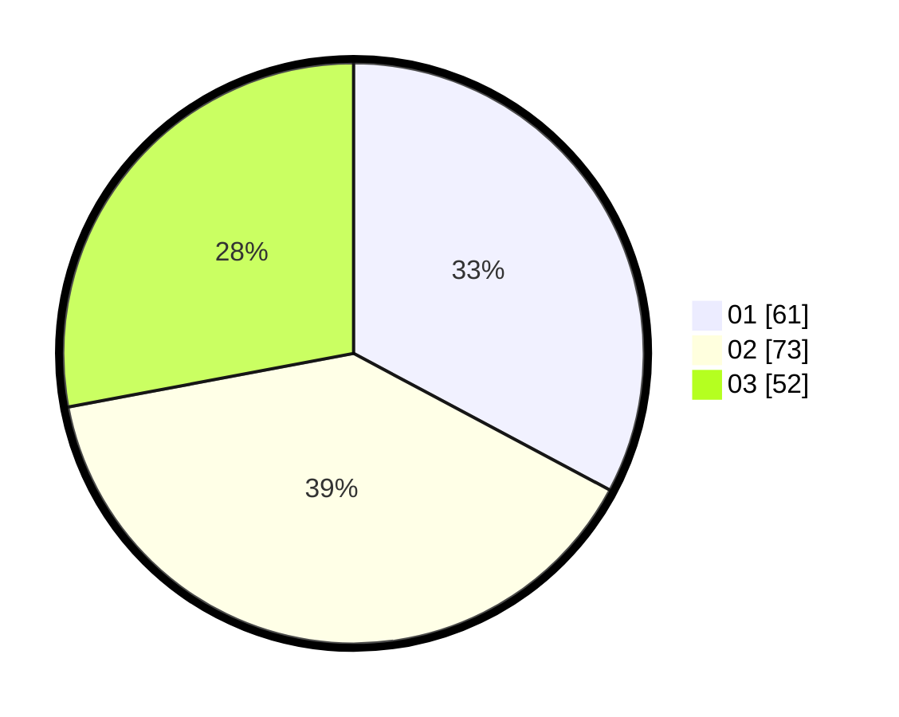

# Hasil

Hasil perolehan suara paslon dapat dilihat pada file paslon-01.txt, paslon-02.txt, dan paslon-03.txt.

Jika tidak ada, artinya data tersebut belum ada pada SIREKAP.

## Perolehan Suara

 * Paslon 01: **61**.
 * Paslon 02: **73**.
 * Paslon 03: **52**.

## Foto C Plano

https://sirekap-obj-formc.kpu.go.id/f8ec/pemilu/ppwp/31/71/02/10/03/3171021003046-20240216-192621--8838304b-25de-428a-b66b-05e80ae69dbb.jpg

https://sirekap-obj-formc.kpu.go.id/f8ec/pemilu/ppwp/31/71/02/10/03/3171021003046-20240218-131240--cc81a8ea-02bd-416c-a8b1-fa7ca77c3519.jpg

https://sirekap-obj-formc.kpu.go.id/f8ec/pemilu/ppwp/31/71/02/10/03/3171021003046-20240218-132800--8c550682-6564-40d0-9718-e5524ca278ec.jpg

## DATA PEMILIH TETAP

Jumlah pemilih dalam DPT: **254**.
 * L: **125**.
 * P: **129**.

## DATA PENGGUNA HAK PILIH

Jumlah pengguna hak pilih dalam DPT: **190**.
 * L: **88**.
 * P: **102**.

Jumlah pengguna hak pilih dalam DPTb: **0**.
 * L: **0**.
 * P: **0**.

Jumlah pengguna hak pilih dalam DPK: **0**.
 * L: **0**.
 * P: **0**.

Jumlah pengguna hak pilih: **190**.
 * L: **88**.
 * P: **102**.

## JUMLAH SUARA SAH DAN TIDAK SAH

JUMLAH SELURUH SUARA SAH: **186**.

JUMLAH SUARA TIDAK SAH: **4**.

JUMLAH SELURUH SUARA SAH DAN SUARA TIDAK SAH: **190**.
