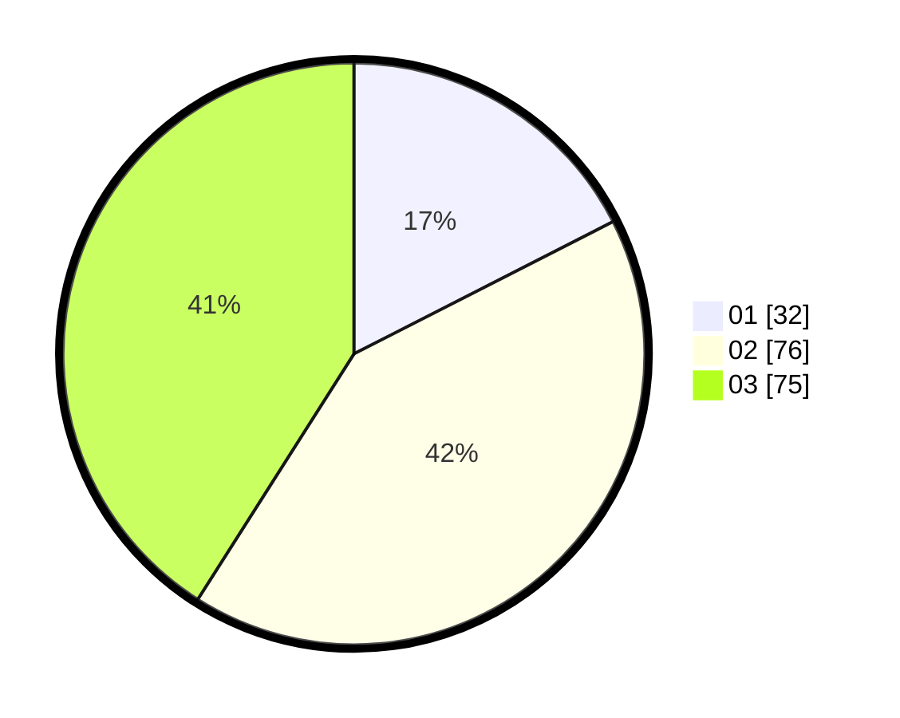

# Hasil

Hasil perolehan suara paslon dapat dilihat pada file paslon-01.txt, paslon-02.txt, dan paslon-03.txt.

Jika tidak ada, artinya data tersebut belum ada pada SIREKAP.

## Perolehan Suara

 * Paslon 01: **32**.
 * Paslon 02: **76**.
 * Paslon 03: **75**.

## Foto C Plano

https://sirekap-obj-formc.kpu.go.id/736e/pemilu/ppwp/31/71/02/10/03/3171021003047-20240218-114750--ab66144c-d532-4942-8679-565ff72dbef7.jpg

https://sirekap-obj-formc.kpu.go.id/736e/pemilu/ppwp/31/71/02/10/03/3171021003047-20240218-115013--713a045c-0be7-47d4-b1aa-f5701f19713d.jpg

https://sirekap-obj-formc.kpu.go.id/736e/pemilu/ppwp/31/71/02/10/03/3171021003047-20240218-114544--917473f3-8635-40fa-8733-4dc15658c0d0.jpg
