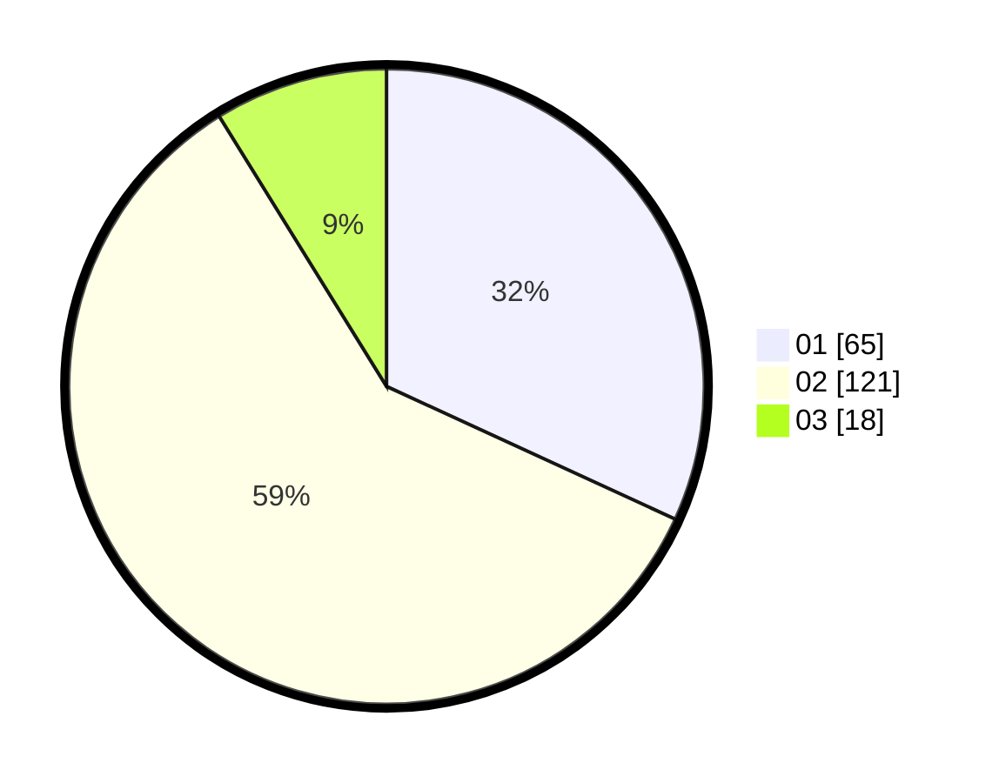

# Hasil

Hasil perolehan suara paslon dapat dilihat pada file paslon-01.txt, paslon-02.txt, dan paslon-03.txt.

Jika tidak ada, artinya data tersebut belum ada pada SIREKAP.

## Perolehan Suara

 * Paslon 01: **65**.
 * Paslon 02: **121**.
 * Paslon 03: **18**.

## Foto C Plano

https://sirekap-obj-formc.kpu.go.id/026f/pemilu/ppwp/31/71/02/10/03/3171021003051-20240217-083007--b642b0ee-e404-4caf-b24d-01d57c64e505.jpg

https://sirekap-obj-formc.kpu.go.id/026f/pemilu/ppwp/31/71/02/10/03/3171021003051-20240217-083239--701ff660-43ed-4d9e-b8b5-34621af9007a.jpg

https://sirekap-obj-formc.kpu.go.id/026f/pemilu/ppwp/31/71/02/10/03/3171021003051-20240217-083404--b4a42f53-40c9-4e40-84a0-8e887d83637e.jpg
