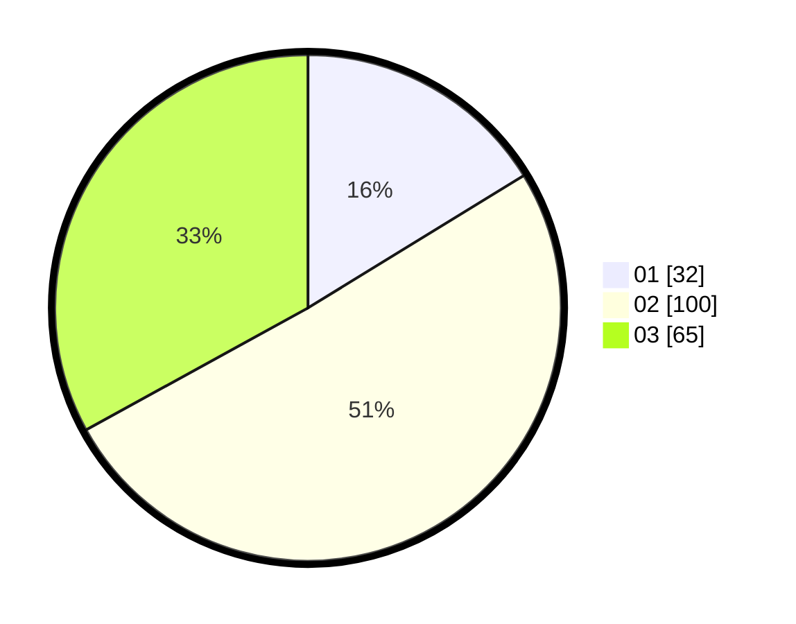

# Hasil

Hasil perolehan suara paslon dapat dilihat pada file paslon-01.txt, paslon-02.txt, dan paslon-03.txt.

Jika tidak ada, artinya data tersebut belum ada pada SIREKAP.

## Perolehan Suara

 * Paslon 01: **32**.
 * Paslon 02: **100**.
 * Paslon 03: **65**.

## Foto C Plano

https://sirekap-obj-formc.kpu.go.id/f5b2/pemilu/ppwp/31/71/02/10/03/3171021003053-20240216-211326--2dacc401-a444-4d31-8d06-989b4ba2f4bf.jpg

https://sirekap-obj-formc.kpu.go.id/f5b2/pemilu/ppwp/31/71/02/10/03/3171021003053-20240216-211327--6145da61-49f2-4825-b527-cc14a9e04a81.jpg

https://sirekap-obj-formc.kpu.go.id/f5b2/pemilu/ppwp/31/71/02/10/03/3171021003053-20240216-211327--d99aecd3-23db-45f2-a7f0-bccc363565b4.jpg

## DATA PEMILIH TETAP

Jumlah pemilih dalam DPT: **272**.
 * L: **145**.
 * P: **127**.

## DATA PENGGUNA HAK PILIH

Jumlah pengguna hak pilih dalam DPT: **200**.
 * L: **103**.
 * P: **97**.

Jumlah pengguna hak pilih dalam DPTb: **0**.
 * L: **0**.
 * P: **0**.

Jumlah pengguna hak pilih dalam DPK: **3**.
 * L: **1**.
 * P: **2**.

Jumlah pengguna hak pilih: **203**.
 * L: **104**.
 * P: **99**.

## JUMLAH SUARA SAH DAN TIDAK SAH

JUMLAH SELURUH SUARA SAH: **197**.

JUMLAH SUARA TIDAK SAH: **6**.

JUMLAH SELURUH SUARA SAH DAN SUARA TIDAK SAH: **203**.
